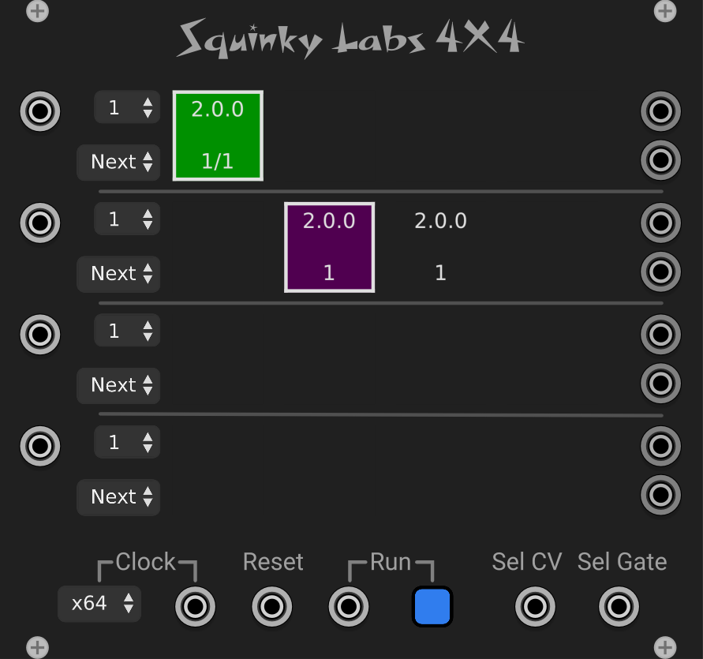

# 4X4 four track sequencer

## Table of contents

[Introduction](#Introduction)\
[Definitions of terms](#Definitions-of-terms)\
[The Pads](#The-Pads)\
[The different ways to switch sections](#The-different-ways-to-switch-sections)\
[Arrange mode](#Arrange-mode)\
[Improv mode](#Improv-mode) \
[When do various sections play](#When-do-various-sections-play)\
[Remote editing](#Remote-editing)\
[The main context menu](#The-main-context-menu)\
[The pad context menu](#The-pad-context-menu)\
[Panel controls](#Panel-controls)\
[The input jacks](#The-input-jacks)\
[The output jacks](#The-output-jacks)\
[MIDI Mapping](#MIDI-Mapping)\
[The clipboard](#The-clipboard)\
[Loading MIDI files](#Loading-MIDI-files)\
[More on the Sel CV/Gate inputs](#More-on-selecting-with-CV)\
[What is the best way to select sections](#Best-way-to-select-sections)

## Important notes for testers

Here are the features that have been proposed but not implemented. Input welcome:

* Separate clock inputs per track. If un-patched, the current "global" clock would be used.
* An option to make section selection take place immediately.
* (your idea here)

## Introduction

At its heart, 4X4 is a four track sequencer. The four tracks are completely independent, other than sharing clock inputs.

In addition, each track has four sections. These sections are complete sequences. By default each section plays after the previous section finishes.

There are 16 pads arranged in a 4X4 grid. Each row of 4 pads represents a track. So all the pads in the first row are for track 1, and all the pads in the last row are for track 4.

4X4 is mostly a playback device. The only way to get data into 4X4 is pasting it from another sequencer, or using **Seq++** as a remote editor. The integration with **Seq++** is pretty transparent, and you may almost forget that 4X4 does not have its own editor / recorder.

Instructions for Seq++ are [Here](sq2.md)

There are two main things that 4X4 does. Firstly, it provides an easy way way to build up a song. Since each clip can be repeated by a specific count, it is very easy to put together "verse/chorus" arrangements.

The other main use of 4X4 is for live improvisation and mangling. There are many ways to queue up new sections under CV or manual control.

## Definitions of terms

A **_clip_** is a series of notes, possibly polyphonic. There is a clip under each pad in the 4X4 UI. For comparison, the entire contents of a Seq++ instance is one clip.

A **_track_** is a series of clips. Each row of pads in 4X4 is a track.

A **_section_** is a group of clips all from different track. Often, all the clips in a **_section_** will play at the same time. A column of pads in 4X4 controls a **_section_** for each track.

## The pads

### Visual display on pads

Much of the fun is in the 16 pads that give 4X4 its name. Each pad displays quite a bit of information, and clicking on the pads makes different things happen.

The color of the pads will tell you many things about what is inside that pad:

* Light green: the pad has notes, and is playing.
* Dark green: that pad has notes, but it not playing.
* Light grey: The pad is empty, but has a duration (rest time), and is playing.
* Dark grey:  The pad is empty, but has a duration (rest time), and is not playing.
* Purple: The pad is selected. At most one pad at a time is selected.

In addition, the next pads to play will have light grey outlines.

Each pad displays a little information about the musical content in the pad. The first line displays the duration of the clip in bars:beats:fractions. The next line displays the loop iteration count for the clip. It defaults to one, but if it were three (for example) then the clip would play three times. After that the next clip would play.

### Clicking on pads

**Clicking** on a pad selects it as the current pad. You can see this because the pad becomes purple. Current pad isn't particularly special, however. At the moment the only thing it does is direct keyboard input to that pad. So x,c,v will cut, copy, and past that pad.

**Clicking** in a pad also queues up all the clips in that column to be the "next clip". More on that later.

**Ctrl-clicking** on a pad will make that one selected, and queue that clip up to be next on its track, but will not affect other tracks.

Here's an example of "next play". If pad one is playing and you click on pad three, then pad one continue to play until it ends, then pad 3 will immediately start playing. By waiting until the end of a clip, everything can stay in sync much easier.

More on this later.

## Arrange mode

There are two main "use cases" for 4X4: composing a song, often with a verse/chorus structure, and improvising. Although all the same features support these use cases, they are often used a little differently, so we will explain things separately to avoid confusion.

The **_arrange_** use case is for laying out a "song", or other pre-composed sequence that will be then played back more or less the same way every time.

Often this means that each column of pads will form a section, and the duration of all the clips in that column will be the same. If this is the case, then as the whole sequence plays, the playing (light green) pads will move together in columns.

Again, it would be common when arranging to have each pad in a section have the same repeat count, and that the repeat count would not tend to be infinite. Repeat count is available from each pad's context menu.

If you arrange in columns, then you can click on a column to cue that up to play next. This lets you easily audition the different sections of your song.

## Improv mode

When Improvising with 4X4 you will probably use ctrl-click to select individual clips to play next. In this way many new patterns will be created by playing various clips from different tracks at the same time.

You can set the repeat count of each section to be infinite. Then it will only change sections when you cue up a new change - either by clicking on a pad, by using the CV inputs, or my MIDI mapping.

Use the CV inputs on each track to move between patterns in that track under external control.

Use the global Sel CV/Gate to cue any of the 16 pads/sections to play next.

If the patterns don't all match up, interesting accidents may occur.

## The different ways to switch sections

Many of the features of 4X4 provide different ways to select the next section to play in a given track. Remember that no matter which method you use, the switch will occur after the current section is finished playing.

Here are the different ways to change which section will play next:

* **Clicking** on a pad on the panel will tell all four tracks which section to play next.
* **Ctrl-clicking** (cmd on mac) will tell the track you clicked on to play that section next. The other three tracks will not be affected.
* **Midi mapping** allows an external MIDI control surface to activate pads as if you had ctrl-clicked on them.
* The polyphonic **Sel CV and Sel Gate** can select any of the pads from any of the tracks.
* The **individual CV inputs** to the left of each track let gates and voltages from other modules change sections in various ways.
* The sections will of course advance to the next one when the current one is finished. The repeat count is used in this case.

There is more on each of these below.

Tip: If you plan on selecting sections interactively you may find it best to set the section repeat counts to "Forever". Otherwise the repeat count may move the section when you weren't expecting it.

## When do various sections play

Unless you command it otherwise, each track will play all of its sections in order. Each section will repeat for a count that you specify. That repeat count is always displayed on the pad for that clip. When the entire track has played, it will loop back to the start.

Each track is completely independent from the others. There is nothing that forces them to be the same duration, or have sections of the same duration. Each track will decide when to advance to the next section independent of the other tracks.

If you click on a pad which 4X4 is playing, the pad will be queued up to play next. When the current repetition of the current clip has finished, that track will move the the queued up clip. So each clip will play in its entirety before moving to the "next" clip.

If you clip on a pad while 4X4 is not playing it well set that clip to be "next", but in this case the next clip is the first clip that will play when 4X4 starts playing.

If you reset 4X4 while it is stopped, it will queue up the first clip in every track to the the first to play.

## Remote editing

Seq++ may be used to edit the sequences inside 4X4. In order to do this you merely enable remote editing from the main context menu in Seq++.

Once remote editing is enabled, selecting any pad in 4X4 immediately sends that clip over to Seq++, where it may be edited with all the Seq++ tools. Selecting a different pad sends over a different clip.

One instance of Seq++ can edit more than one instance of 4X4.

If you are not already familiar with Seq++ we will tell you - you will need to read the manual for Seq++ in order to enjoy using it. It is full of non-obvious commands and features. Once these are learned it is very quick and easy to write music in Seq++.

## The main context menu

When you right click on the 4X4 panel anywhere but on the pads themselves, or other controls, the normal VCV plugin menu will come up. We add three entries to the end of the menu:

* 4X4 manual will open this document.
* Hookup Clock will look for a compatible clock (currently CLocked and CLKD), and hook up the closest one it finds. This is a huge time saver.
* CV select base octave lets you choose what CV range activates Sel CV/Gate to choose sections. It is specified in octaves of C, so "2" means that the notes up from C-2 will select different sections.

## The pad context menu

Right clicking on a pad brings up a context menu for that pad.

**Edit** contains cut/copy/paste, which do what you would expect.  They operate on the entire clip under a pad. So cut will always leave the pad empty. Paste is one way to get a clip into the pad.

**Repeat count** is the number if times the clip in that pad will be played before moving to the next pad. Note that "Forever" is an option, and is very useful when using CV triggers to move between clips.

**Set Next Section** will cause all tracks to queue up the section you right-clicked on. Same as clicking on a pad.

**Set Next Clip** will cause the current track to queue up the section you right-clicked on. Same as ctrl-clicking on a pad.

**Edit Clip** will bring up the clip in Seq++ for editing. Clicking on a pad also does this.

Note that the last three menu items will not be used very often, as clicking the mouse is usually much easier.

## Panel controls

**Clock rate** is the same as in Seq++. It tells 4X4 how to interpret the clock input. For normal use, it should match the setting in your clock module, and should be set to x64. This will be set automatically by the Hookup Clock command.

**Polyphony** Each track has a Polyphony selector to the left of the track. This setting determines the maximum number of channels that may be output for that track. In many cases you can set this to 16 and forget about it, although to get a true monophonic legato it must be set to 1.

**CV Function** Each track has a CV Function selected that determines what the track's CV input will do. The choices are:

* **Next** - a gate applied to the input will queue the next section to play on that track.
* **Prev** - a gate applied to the input will queue the prevsious section to play on that track.
* **Set** - a voltage applied to the input will queue a new section based on voltage:
  * V < .5: does nothing.
  * .5 < V < 1.5: select section 1.
  * 1.5 < V < 2.5: select section 2.
  * 2.5 < V < 3.5: select section 3.
  * 3.5 < V < 4.5: select section 4.
* **Poly** - In this mode the input is polyphonic, and each poly channel does the functions listed above:
  * 1: trigger signal to advance to next clip. The rising edge of the signal will trigger a switch to the next clip for that track. This is similar to what happens when you click on a pad during playback.
  * 2: trigger signal to go to the previous clip.
  * 3: the voltage will directly set the next clip 1V => goto clip 1, 4V=> goto clip 4.

**Run button** starts and stops playback. If you are using a compatible external clock, then 4X4 will get a run signal from the clock, and you will not use this button. Note that run state of 4X4 and run state of the clock must agree with each other. Normally they will as they default to running, and if you use the Hookup Clock command it will make sure this is set right.

## The input jacks

**Track CV inputs** There is a CV input for each track. The input can be programmed for different functions using the CV Function dropdown controls described above.

The currently implemented CV functions  are:

1: trigger signal to advance to next clip. The rising edge of the signal will trigger a switch to the next clip for that track. This is similar to what happens when you click on a pad during playback.

2: trigger signal to go to the previous clip.

3: the voltage will directly set the next clip 1V => goto clip 1, 4V=> goto clip 4.

4: Polyphonic.

## Clock inputs

The **Clock** input must be patched to a clock source. You can use almost anything that puts out a repeating pulse, but it's easiest to use a dedicated clock module like CLKD from Impromptu Modular.

The **Run** input allows 4X4 to be stopped and started from the master clock module.

Similarly, the **Reset** input allows the master clock to start 4X4 back from the beginning.

Clock must be patched; Run and Reset are optional. The **Hookup Clock** command in the main context menu will set all of this up for you.

## The output jacks

All of the outputs are on the right edge of the panel. There are a pair for each track, CV, then gate. So top to bottom is CV 1 out (poly), Gate 1 (poly)... up to Gate 3. If you get confused turn on the tool-tips. There are tooltips for most of the jacks.

## MIDI Mapping

The VCV MIDI-MAP module lets most panel buttons and knobs be controller my MIDI. The VCV module is limited to using MIDI continuous controllers as a source. So you must either pick things on your MIDI controller that already send CC, or reprogram it to do so. Or find a mapper module that is more flexible - there must be some out there.

To use MIDI-MAP with a MIDI controller that has pads:

* Make sure the pads send MIDI cc, or if not set them to do so. They should send a value of 127 when pressed, and 0 when the are up.
* In MIDI-MAP Select your midi device as the source.
* Click on the button that says "Unmapped". It will switch to saying "Mapping..."
* Press you pad. MIDI-MAP will show the MIDI CC number.
* Click the mouse on the 4X4 pad you want controlled. It will show a yellow square, indicating it is mapped, and MIDI-MAP will show the 4X4 pad you selected.

Now pressing that pad will do the same thing as ctrl-click on the pad - it will queue up the section you clicked on in the track you clicked on.

## The clipboard

4X4 and Seq++ support the new portable sequence format, which allows notes to be cut and pasted between different VCV modules. It is currently supported by the Entrian and Impromptu Modular sequencers.

While doing this port we also changed and sometimes improved c/c/p between our modules.

Here are the new rules. Most of these apply only to Seq++:

When we copy something onto the clipboard, we usually just copy the selected note, and don’t remember the original time of the first note, nor the total track duration. This lets you copy from one location and paste in another. (it’s always been like this).

If you do “select all” before copying, however, we will copy the notes at their absolute start time, and remember the total duration. If you paste this into a new instance of Seq++ you will get an exact copy (well, read on).

Normally when we paste from the clipboard we paste the notes directly starting at the time where your cursor is. The track duration is only changed if it isn’t long enough - in that case we add full bars until the track is long enough. (Seq++ has always worked this way).

If you “select all” before paste, that is our cue to not ignore the duration of the original track. We will extend the track out to be that length. This means you can copy a track from one Seq++ to another with ctrl-a, ctrl-c then in the empty instance put your cursor on the first beat at ctrl-a, ctrl-v and it will paste an exact copy.

In 4x4, the paste is what Seq++ would do if you did ctrl-a, ctrl-v. So, to copy a full track from Seq++ to 4X4, ctrl-a, ctrl-c in Seq++, then click on a cell in 4X4 and press V.

## Loading MIDI files

It's very easy to do this if you use Seq++ as a remote editor. Just click on the pad you want to load with data, and it will move into Seq++. Then use Seq++'s Load MIDI File menu item to load the file.

## More on selecting with CV

It's very easy to use the CV/Gate inputs for cueing up new sections to play. Select your MIDI keyboard / interface from the VCV MIDI-CV module. Set MIDI-CV to four voices or more of polyphony. Patch the V/OCT output to the Sel CV input on 4X4. Patch the gate output to the Sel Gate input in 4x4.

Now pressing C2 on your MIDI keyboard will queue track 1, section1.

C2: tk1, section 1. C#2: tk1, section 2, D2: tk1, section 3, D#2: tk1, section4.

E2: tk2, section 1. F2: tk2, section 2, F#2: tk2, section 3, G2: tk2, section4.

G#2: tk3, section 1. A2: tk3, section 2, A#2: tk3, section 3, B2: tk3, section4.

C3: tk4, section 1. C#3: tk4, section 2, D3: tk4, section 3, D#3: tk4, section4.

## Best way to select sections

You may have noticed that there are many ways to determine which section will play next. So - what's the best way? Of course there is no single answer for this.

If you are building up a song structure (**Arrange mode**), then the repetition counts on the pads will almost certainly be the main way to determining when each section plays.

While building up arrangements you will probably be clicking on pads to select that section across all 4 tracks. That way you can easily audition the section you are working on.

If you are picking section "on the fly" (operating in **Improv mode**) then you will find that some of the other methods of selecting sections are very useful.

It's simplest to set the repetition counts all to **Infinite** so that sections won't change "by themselves", but will wait for you to switch them. Of course setting smaller repetition counts will provide a default so that if you don't have time to switch they will switch themselves and keep up the interest.

The individual CV input on each track are good if you want to have other modules like clock, shift registers and other sequencers change sections. For a simple example, run some uncorrelated gates from another module (even some LFOs) into the CV inputs. Leave them all set to "Next". Now as time goes on each track will advance to the next section when its CV input goes from low to high.

The Sel CV and MIDI-mapping of the pads are both good choices if you want your own gestures to control which sections get played. The two methods are fully equivalent so the choice will depend on what MIDI controller you will use, what else you are controlling from that controller, and personal preference.

If you have a MIDI keyboard you can easily connect it to the Sel CV/Gate via the MIDI-CV module. By changing the **CV select base octave** in 4X4 you can map all 16 pads to the bottom octave and change of your keyboard. This has the advantage of working with any keyboard, and not requiring much patching in VCV.

If your controller has pads on it you can patch the via the VCV MIDI-Mapper module, or you can use them in the Sel CV/Gate inputs. To use MIDI mapping you will have to make sure your pads are sending MIDI continuous controller (CC) messages. By default many controllers will send MIDI notes form these pads, so you might have to re-map the function of the pads in your controller. This will vary from easy to difficult, depending on the make of the controller.

You can also map the pads to send a sequential series of MIDI note pitches and treat that like a MIDI keyboard with the VCV MIDI-CV module.
