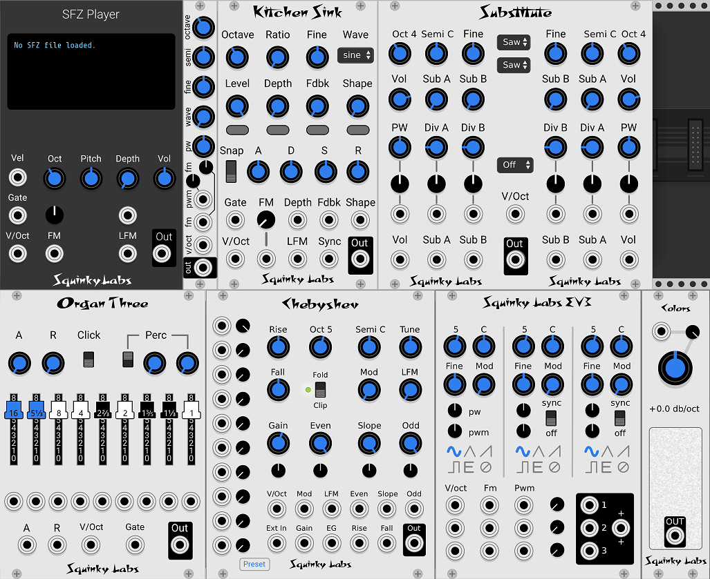
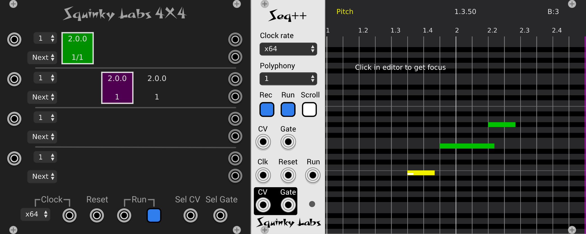
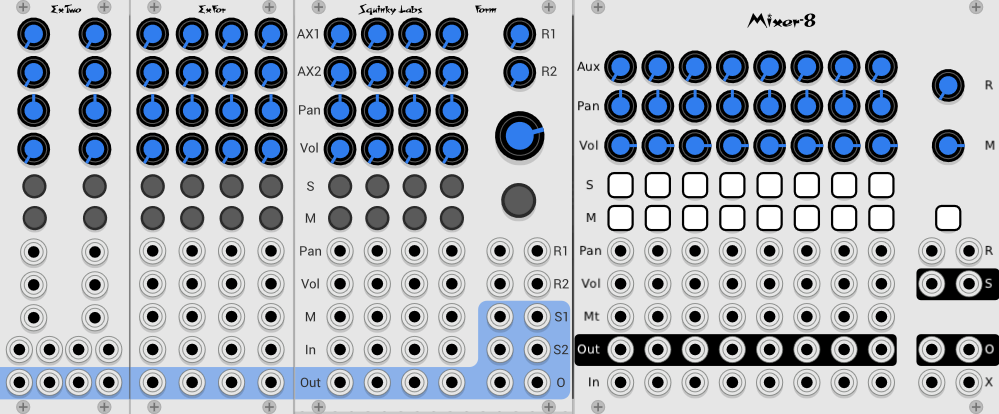
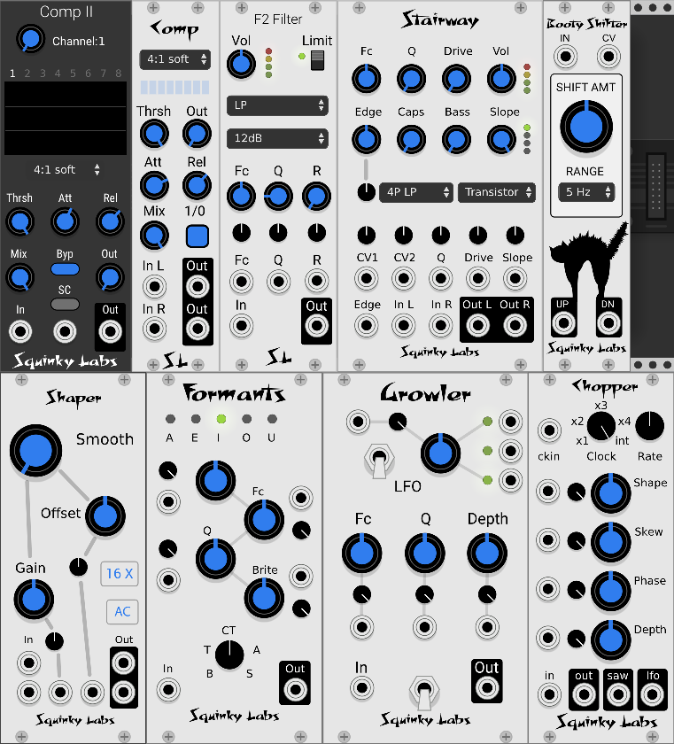
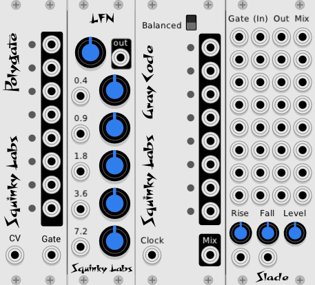

# The Squinky Labs modules for VCV Rack

Below are short descriptions of our modules with links to more detailed manuals.

The module title in the description of each module is a link the the documentation for that module. There is much more information there, so be sure to click on the links of modules you are interested in.

The [Changelog](../CHANGELOG.md) describes recent changes to our modules. (Notice that the word *Changelog* in the previous sentence is a link to the changelog);

# Things that make sound

[SFZ Player](sfz-player.md) is a polyphonic sample player.

[Basic VCO](./basic.md) is a tinny polyphonic VCO that is super clean and uses very little CPU.

[Organ Three](./og.md) is a polyphonic "Organ" module based on the Hammond tone-wheel organs.

[Kitchen Sink](./kitchen-sink.md) is a one operator FM module with the additions on a waves-shaper on the output, and a hard sync input.

[Substitute](./substitute.md) is an homage to the VCO section of the Subharmonium. It has two VCOs per voice, each with two subharmonics, and a just intonation quantizer.

[EV3](./ev3.md) is three VCOs in a single module. Each of the three VCOs is a clone of Befaco's EvenVCO, with oscillator sync added. Like EvenVCO, it sounds good, uses little CPU, and has very little aliasing distortion.

[Chebyshev Waveshaper VCO](../docs/chebyshev.md) can make sounds like no other VCO. It contains a VCO, ten polynomial wave-shapers, and one clipper/folder. Among other things, it is a **harmonic oscillator**.

[Saws](./saws.md) is an polyphonic emulation of the legendary Roland Super-Saw from the JP-8000.

[Colors](./colors.md) is a colored noise generator. It can generate all the common **"colors"** of noise, including white, pink, red, blue, and violet. And all the colors in between.

[Functional VCO-1](./functional-vco-1.md) [deprecated] is an improved version of the Fundamental VCO-1 version 0.6. Now that Fundamental VCO-1 1.0 is so much improved, there is no reason to use Functional VCO-1.

# Sequencers

[Seq++](./sq2.md) is a polyphonic sequencer that provides "DAW-like" music editing in a VCV module. May be used for composing "traditional" music, for triggering patch changes from a timeline, and many other uses.

[4X4](./4x4.md) is a four track polyphonic sequencer. It may be used to enhance the sequencing experience with Seq++ or as it's own real-time sequence queueing controller. 

# Mixers

[Form](./form.md) is a modular mixer with a ton of features. Channels are added by placing expander modules to the left of it. It has two stereo send busses, and anti-pop filters on all CV inputs.

[ExFor](./exfor.md) is the an expander for Form. Each instance of ExFor adds four more channels.

[ExTwo](./extwo.md) is the newest expander for Form. Each instance adds two stereo channels.

[Mixer-8](./mix8.md) is our clone of the AS 8-CH mixer, with more features and 1/10 the CPU usage.

# Things that process sound

[F2 Filter](./f2.md). A different sounding, CPU conserving, VCF with lots of sonic variations.

[Comp](./compressor.md). A studio grade compressor. Will control dynamic range without otherwise coloring the sound.

[Comp II](./compressor2.md). Comp module, optimized for use with Mind Meld mixers. 8 Stereo channels with independent control of each channel.

[Stairway](./filter.md). Polyphonic ladder filter with an enormous range of over-driven and clean sounds. Combines features from Moog, Oberheim, and Rossum filters and adds some some of our own, including four independent wave shapers.

[Shaper](./shaper.md). Yet another wave shaper. But unlike most, this one has almost no aliasing distortion. And a few new shapes that sound nice.

[Chopper](./chopper.md) Is a tremolo powered by a clock-synchable LFO. The LFO is highly programmable to give a range of waveforms. A built-in clock multiplier enables easy rhythmic effects.

[Growler](./growler.md) is a "vocal animator." It imparts random vocal timbres on anything played through it. The pseudo-random LFOs all have discrete outputs.

[Booty Shifter](./shifter.md). An emulation of the legendary Moog/Bode frequency shifter. It is great for "warping" sounds run through it.

[Formants](./formants.md) is a programmable bank of filters that can synthesize various vowel sounds and morph between them easily.

# Other things

[Polygate](./dt.md) is an eight channel gate generator. It takes polyphonic CV and Gate as inputs, and outputs eight mono gate signals. Designed for triggering drums from a polyphonic sequencer, it also has many less obvious uses.

[Slade](./slew4.md) has eight identical channels of lag/anti-pop/envelope generator/VCA, and flexible submixing. Very low CPU, as always.

[Gray Code](./gray-code.md). Think of it as a semi-random clock divider. Or not. Gray codes have the cool property that only one bit changes at a time. Having only one "thing" change at a time can be interesting for music, so we are hoping you will find some good things to do with it.

[LFN](./lfn.md) is a random voltage generator made by running low frequency noise through a graphic equalizer. The equalizer gives a lot of easy control over the shape of the randomness.

# More resources

Here is a video by Dave Phillips that uses a lot of EV3 VCOs, and some other Squinky Labs modules: [A Machine Dream](https://www.youtube.com/watch?v=c2fzgobYjbk).

Omri Cohen has this [Chebyshev tutorial](https://www.youtube.com/watch?v=cv4N_6qRAK8&t=549s)

Artem Leonov has [7 REASONS to use a Tremolo in Modular Environment](https://www.youtube.com/watch?v=UYeEKPMYDoA)
