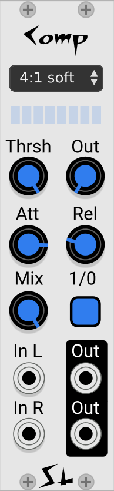

# Comp Compressor

## About Comp

Comp (and like it, Comp II) is a conventional, if highly refined, compressor / limiter. Most of the controls should be very familiar if you have used other compressors. It is a feed-forward compressor, designed for minimum coloration and distortion.

It is fully polyphonic, although all channels will have the same settings.

The "Limiter" is an infinite ratio hard-knee compressor. It is also implemented much differently than the other ratios. Consequently it uses almost no CPU when processing 16 channels. So if you want to "Squash everything" it's a very economical setting.

Comp has fixed (preset) selection of compression ratios and knee width. Using presets like this allows Comp to have very high audio quality without using much CPU.

Comp also has a wet/dry mix to allow "parallel compression", which is very stylish right now.

It can be a little tricky at first to learn how to use a compressor. But there are lots and lots of articles and videos on the Internet that will be very helpful. Also see [using a compressor](./using-a-compressor.md)

When Comp is bypassed the upper/lower Inputs will be directly connected to the upper/lower Outputs.

## vs. Comp II

We have another compressor, called Comp II. The two are very similar. Comp II is designed to be patched into the send/returns of the Mind Meld mixer, although it does not need to be. Comp can be a little easier to use for a stereo signal, and is slightly smaller. Comp II does have a linked stereo mode, and a side-chain which Comp does not. The documentation for Comp II contains a useful block diagram which mostly applies to Comp. Documentation for Comp II [here](./compressor2.md)

## Some uses for Comp

Taming the mix - use on the mixer output. Typically you would use a fairly subtle amount of compression.

Make the drums sit together better. Make a sub-mix of the drums and run the sub-mix through Comp. Anything from a subtle compression to extreme squishing can sound good.

If different synth voices are varying too much in volume, compress each of them a bit.

Completely squish the output of all your filter or synth voices before they go into a VCA. If you use a lot of filtering or other processing on you synth voices, then can end up with more dynamic range than you want. A classic example is sweeping a very resonant filter - as the filter passes through the fundamental, the sound will get very loud. Often that's a good effect, but for a different effect aggressively compress the output of the filter. Since Comp is polyphonic and doesn't use a lot of CPU, it's easy to patch it between the VCO output and a VCA input.

Parallel compression. Parallel compression is easiest to explain when you are talking about acoustic drums, but it's just mixing the compressed and uncompressed signals together. Recording drums is not a super common use case in VCV, but use your imagination. Often people like to compress a drum mix quite a bit. This compression will bring up the room sound as well as the resonant body of the drums themselves. But when high compression with a fast attack is used on drums all the transients get shaved of and you lose the impact of the drums. But if you mix the two together you get the rooms sound and body sound from the compressor, but retain most of the transients of the drums from the uncompressed signal.

Avoid clipping going into the Audio module. If your final mix jumps above 10 V from time to time, it will clip the audio output module. This can sound OK, but sometimes it sounds better if this doesn't happen. If you set Comp to the Limiter setting, turn the threshold all the way up to 10V, set a zero attack and a reasonable release you can avoid clipping on the output without having to reduce the volume of the mix.

## What does "gentle" vs. "aggressive" compression mean?

Of course gentle compression means not very much compression. Aggressive means a lot of compression.

Generally the compression will be more aggressive if:

* The threshold is lower.
* The ratio is higher.
* Hard-knee is used.

## The controls and jacks

Top to bottom.

* **Compression Ratio** how much compression, for inputs that are over the threshold. The higher the ratio, the more compression. Soft-knee gives a more gradual range between compressed and not compressed.

* **Gain reduction meter** Show how much the compressor is compressing. Each section of the meter represents two decibels, so if they are all lit there will be at least 16 dB of compression.

* **Threshold** Signals above the threshold will be compressed, below threshold they will not. So the lower the threshold, the more compression you will get.

* **Out** Makeup gain. Boosts the output. Typically you reduce the threshold to get more compression, but that makes everything quieter. So you add some makeup gain to compensate and make it loud again.

* **Att** The attack time of the compressor. Short attack times will make it compress "faster", but if the attack gets too short all the transients will be compressed.

* **Rel** The release time of the compressor.

* **Mix** Blends the "wet" (compressed) signal with the "dry" (unprocessed) signal. Used for "parallel compression".

* **1/0** Bypass. When the compressor is bypassed the input is fed straight to the output. This allows you to compared the compressed vs. uncompressed sound quickly.

* **In L** Input to the left hand compressor. Left channel many be anything from mono to 16 channels. Polyphony is determined by the upstream device. The left output is right beside the left input.

* **In R** Right channel may also be monophonic, or polyphonic up to 16 channels.
