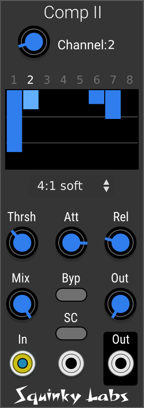
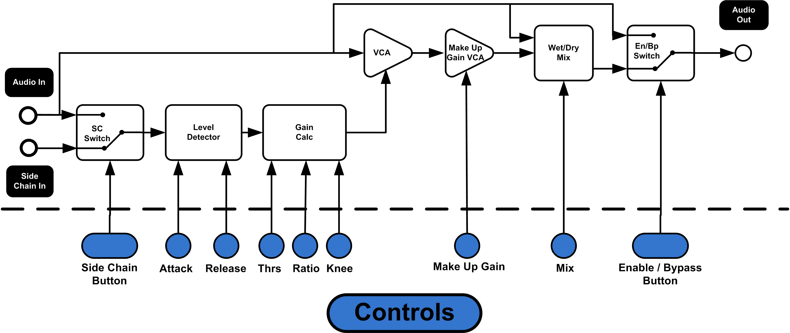

# Comp II Compressor

## About Comp II

Comp II is a 16 channel compressor designed to work with Mind Meld mixers, and other mixers that can send and receive effects on polyphonic cables.

Comp II (and like it, Comp) is a conventional, if highly refined, compressor / limiter. Most of the controls should be very familiar if you have used other compressors. It is a feed-forward compressor, designed for minimum coloration and distortion.

It is fully polyphonic, and unlike Comp, each channel may have different settings.

The "Limiter" is an infinite ratio hard-knee compressor. It is also implemented much differently than the other ratios. Consequently it uses almost no CPU when processing 16 channels. So, if you want to "Squash everything" it's a very economical setting.

Comp II has a fixed (preset) selection of compression ratios and knee widths. Using presets like this allows Comp II to have very high audio quality without using much CPU.

Comp II also has a wet/dry mix to allow "parallel compression", which is very stylish right now.

The compression functionality is identical to our previous compressor, Comp. You can find [its manual here](./compressor.md).

Most of the controls for Comp II are on the panel, but there are some important functions in the context menu, too.

It can be a little tricky at first to learn how to use a compressor. But there are lots and lots of articles and videos on the Internet that will be very helpful. Also see our [using a compressor](./using-a-compressor.md)

## Block diagram of Comp II

## TL;DR Comp II isn't doing anything

When inserted into a patch, Comp II will not have any effect until you change some settings. When Comp II is compressing, this will be reflected in the gain reduction meters. If there are no meter bars visible, Comp II isn't compressing.

Usual reasons are:

* All the channels start disabled (pass-through). Enable the channel in question.
* The channel selector may not be set to the channel you are trying to compress. Make sure this isn't the case.
* The default threshold setting is very high, you will usually need to lower this to make Comp II compress.

## Stereo / Mono / Linked stereo

From the context menu, you may pick any of these modes. They affect all channels. TL;DR for use in the send loop of a Mind Meld mixer, "Linked Stereo" is the most conventional choice.

### Mono

In mono mode, there are sixteen independent channels. Each of the 16 channels may have its own settings. There are 16 gain reduction meters, and the channels are numbered 1 to 16.

### Stereo

In Stereo mode, there are eight pairs of stereo signals. Each of the 8 channels may have its own settings, but within a stereo pair the settings are the same. The channels are numbered 1..8, or 9..16, or G1..G4,A1..A4. This is determined by the _Panel channels_ item in the context menu. These channel naming schemes are the same as used by the Mind Meld mixer.

### Linked-Stereo

This is almost the same as Stereo, with the addition that within a pair, both sides will get the same gain reduction. The prevents the apparent panning from changing as the compressor kicks in.

As a bonus, the mode uses considerably less CPU than the regular Stereo mode.

## Independent control of each channel or pair

At any one time, most of the controls on the front panel are only changing the compression settings of one of the 8/16 channels in Comp II.

The _channel_ knob selects which channel is being edited by the front panel. The other channels are not affected by edits of compression settings from the panel.

There are, however, some features that can speed editing. The context menu has "set all channels to current" as well as "Copy channel" and "Paste channel". These are described in the next section.

## The context menu

Make sure to look in the context menu. There are handy actions in there that can speed up patching quite a bit.

* **Comp II manual** takes you directly to the manual for Comp II. All of our module have a link directly to their manual.

* **Copy channel** copies all the settings from the current channel to the clipboard.

* **Paste channel** pastes the contents of the clipboard into the current channel.

* **Set all channels to current** copies the current channel settings, and pastes them to all the other channels.

* **initialize current channel** set just the current channel back to the default properties.

* **Stereo mono** opens another menu offering a choice of Mono, Stereo, and Linked-stereo. These are explained above.

* **Panel channels** opens another menu offering the following choices: "1-8", "9-16", "Group/Aux". This setting does not affect the sound, it only changes how the different channels are labeled in the gain reduction meter, and in the current channel indicator at the top. Usually you will want these to match the channels in Mind Meld mixer that you are patching.

## The panel controls

* **Edit Channel** Select which compressor channel will be edited from the panel.

* **Compression Ratio** How much compression, for inputs that are over the threshold. The higher the ratio, the more compression. Soft-knee gives a more gradual range between compressed and not compressed.

* **Gain reduction meter** Show how much each compressor is compressing. See below for more information.

* **Thrsh** Signals above the threshold will be compressed, signals below threshold they will not. So, the lower the threshold, the more compression you will get.

* **Out** Makeup gain. Boosts the output. Typically you reduce the threshold to get more compression, but that makes everything quieter. So you add some makeup gain to compensate and make it loud again.

* **Att** The attack time of the compressor. Short attack times will make it compress "faster", but if the attack gets too short all the transients will be compressed.

* **Rel** The release time of the compressor.

* **Mix** Blends the "wet" (compressed) signal with the "dry" (unprocessed) signal. Used for "parallel compression".

* **Byp** Enable/Bypass. When the compressor is bypassed the input is fed straight to the output. This allows you to compared the compressed vs. uncompressed sound quickly. This effect can also be achieved by using the now VCV standard bypass option in the context menu.

* **SC** Enables the side-chain input for the current channel. When the side-chain is enabled the compressor's gain detector does not look at the level of the audio input, it looks at the level of the side-chain input. See [using a compressor](./using-a-compressor.md)

## The gain reduction meter

This is actually 8 or 16 individual meters. Shows the gain reduction for each channel (or pair of channels) in Comp II. The vertical rage is 18 decibels. Like most compressors, the meters expand from top to bottom. There are horizontal lines on the meter to indicate 6 dB of gain reduction and 12 dB of reduction.
