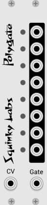

# Polygate polphphonic gate generator

## TL;DR

Set Seq++ to 8 note polyphony, and hook the CV and gate from Seq++ to Polygate. The outputs of Polygate will go high when Seq++ plays a note in the range C4 to G4.

## Intro
Converts polyphonic CV/Gate info to 8 monophonic gates.

An obvious use is to take the polyphonic output from a sequencer and use it to trigger up to 8 drum modules. Hook each output of Polygate to a different drum trigger input. This will allow programming drum parts in a grid.

Another obvious use it to gate individual mixer channels under the control of Seq++ or any other polyphonic sequencer. This this will allow complex "slice and dice" mixing. It also provide and easy to get make a patch change at a certain pre-defined point.

Anytime you want "something" to happen at a specific time, the combination of Seq++ and Polygate is any easy way to do it.

Polygate is very similar to the VCV MIDI-GATE module, except instead of taking MIDI as its input, it takes modular friendly CV and Gate.

## Basic operation

Polygate responds to pitches in the range of 0V to the G above. This corresponds with C4...G4 in Seq++ and most other sequencers.

Each of the 8 gate outputs is activated when a note that matches it's pitch is activated. So the input CV is quantized to semitone, and if the semitone is one of the 8 that Polygate responds to, the gate input is used to set that output high.

For an easy visualization of this, connect the CV and gate inputs to something that generates CV and gate. For testing you can use the VCV MIDI-CV module, although as mentioned above, the MIDI-GATE module is better for this particular use case.

For most interesting results, set the source to output 8 channels.

If you play in some CV and gate where the CV is in the range of Polygate, you will  see the led's blink to follow that gate. If you are playing from a keyboard, and don't see any led's light, try shifting the keyboard up and down and octave or two until you see the led's flash.

When each led is on, the corresponding gate output will be high.
