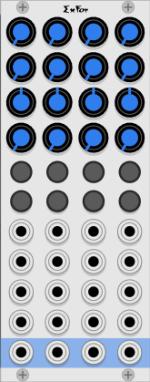

# ExFor four channel mixer expander

ExFour is used to add four channels to the Form "master mixer". ExFour is only really useful when it is part of a chain of a Form mixer and some Ex expanders.

The master Form mixer is always on the right. Then any number of ExFor and ExTwo expanders may be placed to the left.

The ExFor and the other mixers recognize each other, and automatically connect together the stereo master bus, the two stereo aux busses, and the solo bus.  This allows all the linked mixers to act as one without any extra cables.

The ExFor is of course just four channel strips from the Form mixer. Refer to the [Form instruction manual](./form.md) for detailed instructions.

Note that the settings in the context menu only apply to one section, so you may set those options differently for each group of four channels.

If ExFor is not paired with a Form master module, then individual channel features may still be used.

* Each channel can mix a polyphonic input down to mono.
* Each channel may be gate by mute and solo.
* Each channel will function as a VCA.
