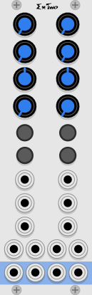

# ExTwo dual channel mixer expander

ExTwo is used to add two stereo channels to the Form "master mixer". ExTwo is only really useful when it is part of a chain of a Form mixer and some Ex expanders.

The master Form mixer is always on the right. Then any number of ExTwo and ExFor expanders may be placed to the left.

The ExTwo and the other mixers recognize each other, and automatically connect together the stereo master bus, the two stereo aux busses, and the solo bus.  This allows all the linked mixers to act as one without any extra cables.

## Normaled mono mode

If you connect an audio signal to the left input of a stereo channel, and leave the right unconnected, a special mode will be engaged. The left signal will be sent to both the left and right outputs, and the pan control, aside from controlling the panning to all the stereo busses, will also pan between the two direct outputs.

So this mode is very similar to a regular mono channel with Form or ExFor, with the additional ability to pan between two direct outputs.

## Context Menu

Most of the mixer controls are on the panel, and are pretty much self-explanatory. But there are some that are on the context menu that you see when you right-click on the panel.

**Send 1 (or 2) Pre Fader**: When this is in the default un-checked state, the aux sends will be post fader, and post pan. This is the most common setting, and is usually appropriate for adding reverb, echo, or bus compression.

When checked, the send will be pre fader. This means that the setting of the pan and volume controls will not affect the signal going to the bus. This is handy for making an entirely separate mix. Perhaps for monitoring or special effects.

**Mute CV toggles on/off**: Normally, when the mute CV is over 1.6 volts the signal is muted, and when the CV goes below 0.8 it is un-muted. But when Mute CV toggles on/off is enabled, each low to high transition of the gate will toggle the mute. First muted, then un-muted.

The settings on the context menu will be saved with your patch. The context menu only controls the four channels of the mixer that you are interacting with - each ExFor module will have its own independent settings.

## Channel strip controls

**S**: Solo. Will turn off all the other channels and let the soloed channel play on its own. Soloing one channel will un-solo the other channels. When solo is active it overrides mutes, i.e. if you solo a muted channel it will play. Pressing an active solo button will remove the solo.

Control-click (Mac Command-click) on a solo button will toggle that channel's solo only. So ctrl-solo is *multi solo*, while regular click is *exclusive solo*. Multi-solo lets you solo more than one channel.

**M** Mute. Silences the muted channel. Note that the larger button on the far right is the master mute.

**AX1, AX2**: Aux send levels. Controls how much of the current channel will be sent to each stereo Aux bus. If the send and return are patched to an echo, for example, Aux will control how much of that channel is sent to the echo.

Aux is post-fader by default, so any channel settings will also affect the Aux send level. But it may be switched to be pre-fader, in which case the mute and solo will still affect it, but pan and volume will not.

**Pan**: On ExTwo this is actually a stereo balance control. To the left it will give the left channel maximum gain and silences the right channel. In the middle both channels are attenuated by 6db.

**Vol**: Controls the channel's volume. Audio Taper.

## Channel strip jacks

**Out**: The channel's left and right direct output. This is always post-mute and post-fader.

**In**: The channel's audio inputs

**M**: Mute control voltages in. These go through the mute anti-pop filters, so sharp gates may be used without pops. They can be momentary or toggle. See section on context menu for more on this. Because the mute CV has a pop filter on it, you can automate the mute with fast gate signal without popping. For example use the outputs from Gray Code to automate them.

**Vol**: CV input for volume control. This also has a pop filter.

**Pan**: CV input for pan control. Again, there is a pop filter.

**AX2**: Controls the amount of the signal from the channel to be mixed into the Aux 2 bus.

**AX1**: Controls the amount of the signal from the channel to be mixed into the Aux 1 bus.

Note that the settings in the context menu only apply to one section, so you may set those options differently for each group of four channels.
