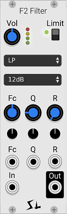

# F2 Filter

F2 Filter is a polyphonic, four pole VCF with unusual features and sounds.

F2 VCF is designed to have some unusual sonic options and to use very little CPU. Most VCFs use a lot of CPU to try to ensure that they sound good when over-driven. F2 VCF, on the other hand, doesn't sound very good if it's over-driven, so we a) made it difficult to overdrive, and b) added some other unique options to take the sounds in some directions other filters may not go. And c) saved a ton of CPU by doing so.

F2 VCF offers a choice of 12 or 24dB filter, and a choice of filter response. The 12dB setting, while not as "fat" as the typical 24dB ladder filter, is often a welcome break from more aggressive and fatter filters. And in 24dB mode F2 will roll-off a little faster than the typical ladder filter.

F2 VCF also has a unique control called "R". This works in any of the 24dB modes, and acts to "spread apart" the four-pole resonant peaks into two two-pole resonant peaks.

When F2 is bypassed the Input will be directly connected to the Output.

Because this VCF uses so little CPU compared to others, you can use lots of them. Don't hesitate to use them all over the place if you feel like it. Or use a whole bunch of them in a single voice.

## Some ways to use F2

Use it as a straight 12dB multi-mode filter. It's got all those different responses, and even as a low-pass it sounds different from other filters.

Use it as a 24dB multi-mode filter. There aren't very many of these around offering true band-pass, high-pass and notch. Even our "Stairway", which does a lot of things, can't do this.

Use it as a 24dB filter with two resonant humps. Just put it in 24dB mode and turn the "R" control to move the resonances apart. Or control R with a CV. Try "Par" mode, which can make it easier to hear both peaks.

Use it as a dual notch filter. Put it in 24db/Notch mode, and turn up the R control to move the notches apart. Use different CV modulation to get phasing or vibrato sounds.

Use it as an LPG (or HPG, etc.). Put it in "Par -" mode. It won't pass any sound at all until you put something into the "R" input. Patch an ADSR into the R control and F2 will act like a gate/filter. But it won't sound like every other LPG.

## The limiter

The limiter is not adjustable, it only has an on/off control, and a two way selector called "Alt". It has a fixed threshold, a fixed attack and a fixed release. Being a limiter, the compression ratio in infinite.

## Controls

**Fc** knob controls the center frequency of the filter. When R is turned up, Fc will move both of the peaks.

**Q** is filter resonance. Acts like other filters.

**R** Increasing R breaks up the resonant peak into two resonant peaks. R is how far apart they are. Does not do anything with the 12dB filter setting.

**Limit** turns the built in limiter on and off. Usually you want to leave it on.

**Mode** offers four choices: Low-pass, Band-pass, High-pass, and Notch.

**Topology** offers four choices, 12dB, 24dB, Parallel, and Parallel difference. Note that the parallel is exactly the same as the 12dB, unless the R value is changed. Then it will produce two peaks. The effect of "R" is more obvious with the parallel topology than with the normal 24dB topology.

Parallel difference mode is a little odd. Inside it's just subtracting the outputs of the two filters, but.... If R is set to zero, nothing will come out. This means you can gate the output using R. This is a little bit like an LPG in that the timbre will change as the volume shuts off.

**Alt Limiter** This is an on/off setting in the context menu. When "Alt" is on the limiter is a little faster, and a little different sounding.

## Polyphony

F2 is fully polyphonic and follows the VCV recommendations for polyphony.

The number of voices (polyphony channels) is determined by the audio input. If you patch 6 polyphonic channels into the input, F2 will run 6 channels, and the output will have 6 channels.

The CV inputs (Fc, Q, R) are polyphonic. If you patch in a polyphonic CV, each channel of the CV will control the corresponding channel of F2. If a monophonic CV is patched in, it will go to all channels.

## The gain structure

As we mentioned before, you won't want to drive this filter super hard - the distortion is pretty uninteresting, and it will alias like crazy.

The easiest way to control the volume is to leave the limiter turned on. It also sounds really cool like this.

There is a VU meter next to the volume knob. As long as the red LED is mostly off you are not clipping the filter, nor the next module it drives.

## Some basic tips for getting sounds

You can get much more radical filter sweeps when the limiter is on. With the limiter off some of the frequency extremes won't catch many harmonics, but the limiter will bring them up. Also, when the limiter is off F2 acts like a normal filter, and the volume will rise and fall quite a bit as Fc is moved over prominent frequencies, but this does not happen when the limiter is on. The limiter give an unusual sound to F2, and we like it.

When experimenting with the R control, sweep the Fc control around. Since increasing R moves the larger frequency peak down, it sounds a little bit like the filter is closing, so you may need to open it up with Fc to get the effect. When learning about what R does, keep Q pretty high, and experiment with both the Fc and R controls. And remember that R does nothing in the 12db filter mode. Many times a large R value will split the peaks so far from each other than you can't heard it any more. Lower R values can be a good place to look for sounds.

If you are trying to use F2 as a gate, you will probably want to turn the limiter off.

Similarly, if you are running dynamic sounds through F2 you may want to turn the limiter off.

## CPU efficiency and aliasing

As long as the VU meter is not red, F2 will not generate audible aliasing. When the limier is off it generates none; the limiter itself will generate a very, very small amount of aliasing.

F2 uses very little CPU, especially compared to other VCFs, which by their nature can use a lot of CPU. Many modules will also use much more CPU if you put varying signals (like audio) into their CV inputs. F2 does not - it continues to use very little CPU, even when all inputs are driven.

Because F2 uses VCV's vector SIMD library, the CPU usage is the same for four voice polyphony as it is for monophonic operation.

Lastly, the limiter uses almost no CPU, so you probably won't see any difference at all on VCV's CPU meters if you turn the limiter on and off.

## Frequency response

There are some graphs of typical frequency response here: [Page of freq response](./f2-resp.md)
