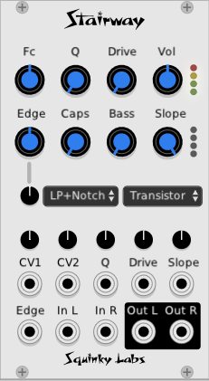

# Stairway ladder

Polyphonic ladder VCF with influences from Moog, Oberheim, Rossum and others.

Stairway is yet another transistor ladder filter, but one that combines many of the ladder enhancements that have been discovered over the decades since the original Moog filter first came out.

Stairway Provides many more shapes that just four pole low-pass. We believe this innovation was first used in the Oberheim Matrix-12, although our implementation is a little different.

Like the Moog filter, Stairway has a pleasant mild distortion to make it sound fat, although it is possible to dial in more and quite different distortions.

Stairway is by no means an accurate "model" of a specific moog filter. It is based on a standard good quality model of the transistor ladder, but it uses no component level modeling, and has not been painstakingly voice to sound as close as possible to a Moog. The intention of Stairway is to be rich and warm like a Moog, but with a lot of other sounds, too.

Stairway provides much more control over distortion and overdrive that most filters. The Drive, Edge, and Voicing controls all work together to give a huge range of over-driven sounds. The four independent wave-shapers between the filter stages are where most of the magic comes from.

Stairway is "stereo". There are two independent channels. But they will be inactive (using no CPU) if they are not patched.

There are extensive notes at the bottom of this page about how the filter actually works.

## Important notes

Although the filter can produce many responses besides just four pole lowpass, it it still at its heart a four pole lowpass with some fancy stuff on top. Because of this, many of the responses other than lowpass will work less well the more the filter itself is pushed away from perfection. So with enough *Drive*, *Edge*, *Caps* and such it will be less and less like a highpass or a bandpass. This can be dramatic, so if you want the highpass or bandpass to be close at all to their real shape, it's very important that the edge control be exactly in the middle. Sometimes re-initializing the module is the easiest way to get there.

Many of the controls change the distortion level or the character of the distortion. So sometimes turning one won't sound that much different from turning another one. Or you keep adding more and more distortion until everything is just a big flabby mess. The Drive, Voicing, and Edge all add or change distortion. When you are first learning to find sounds with Stairway, try keeping the distortion to a moderate level so that it's easier to hear what the other controls do.

Also, adding a lot of distortion starts to make the filter act less like a filter. This is particularly true with "extra" filter types. These filter types will only sound as advertised if the Drive is moderate. Also, the Edge and caps controls can make the frequency response of the extra filter types change a lot. They are all useful sounds, but again, while learning about the different filter types it can be easier if you keep the other controls near their default settings.

The *Voicing* control selects different wave-shapers between the filter stages, and some of these are quite different sounding. Some of them will generate even harmonics as well as odd. The standard transistor ladder has very little even harmonic content.

Lastly, the CV inputs labeled "CV1" and "CV2" both modulate the filter cutoff. More about this below.

## A note about polyphony

The implementation of polyphony is fairly conventional. The number of channels coming into the left audio input determines the number of channels that Stairway will process. All of the other CV inputs may be fully polyphonic also. But if you patch a mono CV into any of the inputs of Stairway then it will apply to all the filters.

## Controls

**Fc** - Filter cutoff.

**Q** - Filter resonance, or Q. At the moment it won't usually go into self oscillation. I should fix that.

**Drive** - Controls the signal level going into the filter. More drive gives more distortion. Too much and the filter stops working right and gets all flabby.

**Vol** - Output level control. Since the different settings can have a big effect on the level, the Vol control is provided to even things out. There is an LED output level meter next to the knob. It will track the hottest of the stereo channels, and the red LED comes on at +/- 7 volts, with each step below that being -6db.

**Edge** - Redistributes the distortion in different ways between the four filter elements. In the middle all stages have the same gain, like most ladders. To the left, the first stages get more distortion than the later one. And to the right the later stages get more.

**Type** - Filter response type. Choices are four pole lowpass, three pole lowpass, two pole lowpass, one pole lowpass, two pole bandpass, two pole highpass with one pole lowpass, three pole highpass with one pole lowpass, four pole bandpass, one pole lowpass with notch, three pole allpass with one pole lowpass, three pole highpass two pole highpass, one pole highpass, notch, and phaser.

Many of these filter type are not what you would normally expect from, say a highpass filter. But they are all useful sounds. Also note that technically when the resonance it turned up, they are all going to have four poles - of course it is impossible to truly make a one-pole resonant filter.

**Voicing** - Selects different types of distortion. The first selection, *Transistor* is the standard one that is pretty close to a Moog. The "Asym" ones have a lot of even harmonics, the others are all odd harmonics. Some of them, like "Fold", will radically affect the sound. The *Clean* settings has no distortion at all.

**Caps** - Simulates inaccurate capacitor values. At the minimum setting, the are all perfectly matched. As the value is increased, they go to typical values that would be found in a Moog, up to very imprecise values. That said, the effect is pretty subtle, and heard mostly as a reduction in resonance. It is more noticeable, however, with the "alternate" filter responses.

**Bass** - Reduces the infamous "bass suck" of the moog filter. When it's all the way down it's like a regular moog, and the bass will decrease as the resonance increases. When Bass is all the way it then there is no bass suck.

**Slope** - Sets the filter slope continuously between -6 and -24 db per octave. Only operational with four pole lowpass. The top (fourth) LED is for -24 db/oct, or four poles.

## CV and attenuverters

Many of the controls listed above may also be voltage controlled. Most of the CV inputs are clearly labeled. Each CV has an associated attenuverter to scale it before it is combined with the control knob. Remember that the attenuverters default to the middle "off" position, so they must be set somewhere else to allow the CV to affect the filter.

Most of the attenuverters are directly above the CV they control. The exception is the lone attenuverter above them that controls the Edge CV.

The two inputs labeled "CV1" and "CV2" both control the cutoff frequency of the filter. The two inputs each have their own attenuverter, then the outputs of the two attenuverters are combined and sent to the cutoff frequency. The allows two Fc modulation sources without using an external mixer.

## About stereo

There are two sets on inputs and outputs. They share the same settings, so are convenient for processing stereo signals. A channel will only use CPU resources if both its input and output are patched.

If only one input is patched, both outputs will have the same mono signal. If both inputs and outputs are patched, then Stairway will have two independent channels.

Stereo and polyphony are mutually exclusive. Stereo mode deals with two monophonic channels, left and right. When used polyphonically there are up to 16 channels in the left input and output, and the right is inactive.

## Suggestions

The "lower order" lowpass settings, like one and two pole can sound nice and bright. Using 1P LP with the Edge all the way up and a decent drive can get some fairly bright sounds.

Sometimes the Edge control will make the sound darker or brighter. Use it to dial in the sound.

Play a sin wave into the filter and watch the output on a spectrum analyzer. This may help reveal what the different distortion controls do. Similarly, if you run white noise into a the spectrum analyzer will show you the frequency response. Use this to learn more what Type, Caps, Q, and Fc do.

Run an ADSR envelope into the slope control, and invert is with the attenuverter. Like modulating the Fc, modulating the slope can make the notes have a bright attack and then mellow out. But is sounds quite different, and is much less common (since so few filters have a slope control).

For crazy, semi-chaotic sounds, use the "Asym Fold" voicing.

## More details on Stairway

### Basic Moog emulation

Stairway is an emulation of the Moog ladder filter, with a lot of extra features thrown in.

The standard way to emulate the Moog filter is to use four one pole lowpass filters in a row, and put a non-linear saturator in between each one. Usually the tanh function is used for the saturator as it is a very good model of how the transistors in the Moog filter saturate.

Then, to realize the correct frequency response digitally, it is implemented as Zero Delay Filter, or by using standard filter oversampling.

We started with this standard high quality emulation. We chose oversampling as it let us implement some of the extra features more easily.

### Additional filter types

In 1978, Bernie Hutchins published an article in his Electronotes (issue 85) entitled "Additional Ideas For Voltage-Controlled Filters". In the article he outlined how a lowpass ladder could easily be modified to produce many filter responses other than the normal lowpass.

This idea was (we believe) first commercialized in 1984 by the Oberheim Matrix-12 analog polyphonic synthesizer.

This idea was also commercialized in the Mutable Instrument 4 Pole Mission filter board for the Struthi synthesizer. This was released in 2011 or 2012, and designed by the legendary Émilie Gillet.

We imagine that there are many digital filters that use this technique. In VCV the Blamsoft FXF-35 in transistor ladder mode seems to.

In Stairway we use the Mutable Instruments method of adding the extra filter types, which give somewhat different responses than the Matrix-12 method.

### Bass makeup gain

The Moog filters are somewhat infamous for an effect called "bass suck". As you turn up the resonance, the bass seems to go away.

Now, let's back up a bit. With any resonant lowpass filter increasing the resonance is going increase the difference in volume between the frequencies at resonance and the lower frequencies. It happens that in the very simplest implementation of a ladder filter the gain stays more constant at resonance and the low frequencies are attenuated. Whereas with the simplest implementation of a state variable filter the low frequency gain stays constant, and the frequencies at the resonant frequency are amplified.

Long ago it was discovered that it is very easy to modify the standard ladder to be like the state variable filter - no bass suck. Over the years many filters have made one choice of the other.

But there is no one answer that is always right. Sure the Moog will suck out the bass when you increase the resonance, on the other hand some filters will get extremely loud and/or distorted at the resonance is increased.

The Evolution filter has a control, which they call "Q Compensation" that lets you control what happens when the resonance is increased. So we borrowed that good idea.

### Different types of distortion

A ladder filter (or any filter) is a fun playground for distortion. Combining multiple saturators with multiple filters results in a complex non-linear dynamic system that can get a lot more sounds than a regular memoryless non-linearity.

As we mentioned before, the transistor ladder can be modeled closely with the tanh function, which sounds great and is our default.

There are a couple of filters for VCV that give you a choice of the type of non-linearity, but we went crazy and put a bunch in. The Moog filter will generate only odd harmonics, so we wanted have some options that add even harmonics too.

So, "Transistor" just puts a tanh in front of each of the four filter stages. "Asym Clip" alternates - the tops are clipped off going into the first and third stages, whereas the bottoms are chopped off going into the second and fourth. Carvin guitar amps patented that in the 70's to emulate a tube guitar amp using a cheaper solid state amp. The "Fold" is four standard wave folders, one in front of each filter stage. "Asym Fold" is similar to "Asym Clip" - half the stages fold the tops, the other half fold the bottom.

The distortion types start to sound quite different from each other when there is lots of resonance and a good amount of drive.  The wave folder can go from aggressive to very aggressive to completely unstable.

### Edge

In most, if not all, ladder filters, each stage has a gain of 1. This means that when the first stage saturates, the next stage is going to see less signal, and will saturate less. So the bulk of the distortion is generate in the first stage, then it gets filtered through the next stages.

The result is a nice, fat, warm sound. Which is great.

We thought - but what about other sounds? The *Edge* control does this. In the middle position, the gain is the same in all stage. As the control is increased the first stages get their gain reduced, and the later stages get more gain. Decreasing the "Edge" from the middle does the opposite - more gain in the early stages, less in the late.

It must have been done before, probably several times, but we know of no filter that has a control like this.

## Slope control

This is another old trick, although the only examples we can cite at the moment are the Rossum Evolution filter, and in VCV the Alma ladder filter from Lindenberg Research. The idea is that by cross-fading between different lowpass filter slopes (6, 12, 18, and 24 in our case), you achieve the effect of a lowpass that is continuously variable between these extremes.

In Stairway the slope control is only active when the filter is in four pole lowpass mode. In all other modes the control is inactive and the LEDs are dim.

## Further reading

[Additional Ideas For Voltage-Controlled Filters](http://electronotes.netfirms.com/EN85VCF.PDF)

[Evolution filter description](https://www.modulargrid.net/e/rossum-electro-music-evolution)

[Paper on the Mutable Instruments filter](https://mutable-instruments.net/archive/documents/pole_mixing.pdf)
