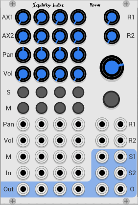

# Form four channel modular mixer

Form is a feature packed four channel mixer that can be expanded to any number of channels by stacking it with Ex series expander modules. See the [ExFor manual](./exfor.md) or [ExTwo manual](./extwo.md) for more on how to do this.

Form is an enhanced version of our Mixer-8, which was based on the AS 8-CH mixer, with some added features. Form and the expanders have diverged enough from the AS mixer that we can't call them clones, although we have retained the equal power pan formulae from the AS mixer.

To the Mixer-8 features, Form adds many more features:

* Two stereo aux buses.
* Aux sends may be post-fader or pre-fader.
* All CV and controls have anti-pop now (volume, volume CV, pan, panCV, mute, mute CV).
* Volume controls now have audio taper, rather than linear taper.
* Mute CV can be momentary or toggle.
* Master and bus returns now have up to +6db gain.
* Channel inputs are polyphonic.

This manual will use the word *fader*. Fader is an audio term that often refers to the linear travel volume controls found on many mixers. But fader can also apply to regular round volume controls. In the case of Form we use round controls to save panel space without having to make the controls too small to use, but we call them faders.

## Context Menu

Most of the mixer controls are on the panel, and are pretty much self-explanatory. But there are some that are on the context menu that you see when you right-click on the panel.

**Send 1 (or 2) Pre Fader**: When this is in the default un-checked state, the aux sends will be post fader, and post pan. This is the most common setting, and is usually appropriate for adding reverb, echo, or bus compression.

When checked, the send will be pre fader. This means that the setting of the pan and volume controls will not affect the signal going to the bus. This is handy for making an entirely separate mix. Perhaps for monitoring or special effects.

**Mute CV toggles on/off**: Normally, when the mute CV is over 1.6 volts the signal is muted, and when the CV goes below 0.8 it is un-muted. But when Mute CV toggles on/off is enabled, each low to high transition of the gate will toggle the mute. First muted, then un-muted.

The settings on the context menu will be saved with your patch. The context menu only controls the four channels of the mixer that you are interacting with - each ExFor module will have its own independent settings.

## Audio taper

There are two kinds of volume controls commonly found in audio equipment: linear taper and audio taper.

Linear taper is easy to understand - the level will be directly proportional to how far it is turned up. So full level all the way up, half level when halfway down.

But humans do not perceive loudness linearly, we perceive it  logarithmically. That is why the unit of loudness is "decibel", which is basically the logarithm of the level. But audio does not use log taper controls, because we want the volume to go to zero when we turn it all the way down, and zero volume is negative infinity decibels.

So audio taper was invented. Ideally audio taper is logarithmic through most if its range, becoming linear at the very quiet end. So it responds evenly at moderate to high levels, but becomes linear when quiet so it can cut the sound at zero.

The channel volumes in Form are log for the top 3/4. At 1/4 the gain is -18 decibels, and it goes linearly to zero below 1/4.

## Channel strip controls

**S**: Solo. Will turn off all the other channels and let the soloed channel play on its own. Soloing one channel will un-solo the other channels. When solo is active it overrides mutes, i.e. if you solo a muted channel it will play. Pressing an active solo button will remove the solo.

Control-click (Command-click on Mac) on a solo button will toggle that channel's solo only. So ctrl-solo is *multi solo*, while regular click is *exclusive solo*. Multi-solo lets you solo more than one channel.

**M** Mute. Silences the muted channel. Note that the larger button on the far right is the master mute.

**AX1, AX2**: Aux send levels. Controls how much of the current channel will be sent to each stereo Aux bus. If the send and return are patched to an echo, for example, Aux will control how much of that channel is sent to the echo.

Aux is post-fader by default, so any channel settings will also affect the Aux send level. But it may be switched to be pre-fader, in which case the mute and solo will still affect it, but pan and volume will not.

**Pan**: Pans the channel left to right. Uses the AS Mixer's equal power pan law.

**Vol**: Controls the channel's volume. Audio Taper.

## Channel strip jacks

**Out**: The channel's direct output. This is always post-mute and post-fader.

**In**: The channel's audio input. This input is polyphonic. If the patch cable is carying more than one channel, they will all be mixed together, and the volume normalized.

**M**: Mute control voltages in. These go through the mute anti-pop filters, so sharp gates may be used without pops. They can be momentary or toggle. See section on context menu for more on this. Because the mute CV has a pop filter on it, you can automate the mute with fast gate signal without popping. For example use the outputs from Gray Code to automate them.

**Vol**: CV input for volume control. This also has a pop filter.

**Pan**: CV input for pan control. Again, there is a pop filter.

**AX2**: Controls the amount of the signal from the channel to be mixed into the Aux 2 bus.

**AX1**: Controls the amount of the signal from the channel to be mixed into the Aux 1 bus.

## Master section controls

**Big knob**: Master volume. Controls the level of the signals coming from the **O** outputs. Audio taper, and all the way up provides +6db of gain.

**Big button**: Master mute.

**R2**: Aux bus 2 return level. The level of the signal patched into the R2 jacks is controller by this knob before it is mixed with the other buses into the **O** output.  Audio taper, and all the way up provides +6db of gain.

**R1**" Aux bus 1 return level.

## Master section jacks

**O**: Main stereo outputs.

**S2**: Aux bus 2 send. Typically patched to an effect like reverb. This will be a mix of all the individual channel's Aux 2 sends.

**S1**: Aux bus 1 send. Typically patched to an effect like reverb. This will be a mix of all the individual channel's Aux 1 sends.

**R2**: Aux bus 2 return. Typically patched to the output of the effect the send is patched to. Signals here will be attenuated by the "R2" knob, and mixed into the master output.

**R1**: Aux bus 1 return. Typically patched to the output of the effect the send is patched to. Signals here will be attenuated by the "R1" knob, and mixed into the master output.
