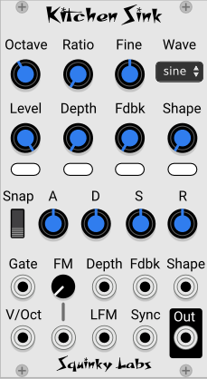

# Kitchen Sink

Kitchen Sink is a VCO that contains a sinewave oscillator that can do "through zero linear FM", with an ADSR, a wave-shaper, and a bunch of VCAs. If you are familiar with the FM OP VCO, it's a lot like that, with the addition of the wave-shaper and a VCO sync input.

The ability to do FM along with other classic forms of synthesis gives quite a wide palette of sounds that would typically require many more modules to achieve.

The build-in envelope generator can be set very fast, but also it is capable of Moog-like "snap" as an option.

In addition to the sine waveform, the wave-shaper in triangle mode can can morph from triangle to sawtooth, and the wave-folder setting generates classic wave-folder timbres reminiscent of the Buchla modules.

The built-in ADSR is lifted from the Fundamental ADSR, but we made it a little faster and added the Mini Moog “snap”. Snap is assumed to be an accident in the old Moog modules, but it gives the envelope more of an AHDSR shape, without requiring finicky settings of the Hold time.

It has octave and ratio. The ration only goes up (x2, x3, x4), since the octave lets you get ½, ¼.

It’s fully polyphonic.

## A pedantic note about FM vs. PM

Most modules and synthesizers that claim to do "FM" really use phase modulation. Even the DX-7 used PM. The advantages of phase modulation of frequency modulation are:

* PM Timbres stay the same as pitch is changed, whereas FM doesn't.
* FM can easily go out of tune when heavy amounts of FM are applied. PM doesn't have this problem.

So we use phase modulation, as do most "FM" VCOs.

## Some patch ideas

**Classic wave-folder patch**. Don't use any FM. Set the waveform to wave-folder. Route the ADSR to the "Shape" parameter. As more modulation gets to the "shape" it will fold more, hence get brighter. It sounds a little bit like a swept sync VCO, but not really the same.

Instead of using the build in ADSR for the shape modulation, you may patch anything into the shape input.

**Classic hard sync**. You need two VCOs: carrier and modulator. Kitchen sink will be the carrier, you can use anything for the modulator. Run an output like a square or saw from the modulator to the sync input of the carrier. Set the initial frequency of the carrier above the modulator. Modulator will set the pitch, carrier frequency sort of sets where the harmonics will be. Try sweeping the carrier frequency for all sorts of classic (old school) sync effects.

**FM with other waveforms**. Use the triangle / saw waveform as either the carrier or modulator waveforms in a two operator FM patch. While you are doing this, patch some other CV into the shape input to morph it between triangle and saw.

**Morph from Triangle to Saw**. Don't use any of the FM or sync options, but just use it as a VCO with a waveform that morphs from triangle to saw from a CV input.

**Combine features**. There aren't many VCOs that let you use FM, sync, and wave-folding all at the same time. Since all of these features tend to add a lot of harmonics, most attempts to combine them will probably result in a fizzy mess. But there are also many cool sounds lurking in there somewhere. Or if you are looking for a big fizzy mess, go crazy and turn these all up!

## A bit about FM

The VCO you listen to is called the "carrier". The one that is modulating its frequency is called the "modulator". So a simple "two operator" patch would be  modulator => carrier => output. Of course, there is nothing to keep you from mixing some modulator into the output, but for FM you must be modulating the pitch of a VCO, usually from a different VCO.

The sounds you get out can sometimes be hard to predict, but in general:

* The more FM, the brighter it is.
* Chaining several FM VCOs together can get more unusual sounds.
* As the ratio of the two frequencies gets farther apart, the sound can get more complex and inharmonic sounding. If you stay with small ratios like 1:1, 2:1, 3:1 you will get more "nice" sounds.
* Usually the modulator must be at the same frequency as the carrier, or lower. If the modulator is higher in frequency the FM will not sound very dramatic.
* It is common to use an envelope generator to control the FM depth, as this is an easy way to get a "dynamic timbre" from an FM oscillator. Sort of like running an ADSR into a filter CV is a subtractive patch.

## How the knobs, CV inputs, and ADRS interact

Most of these work identically in kitchen-sink. Let's use "Depth" as an example.

If there is nothing patched to the Depth input, and the ADSR button below the depth knob is "off", then the linear FM modulation depth is controlled entirely from the knob.

If a signal is patched into the Depth input, then the knob and the CV together determine the modulation. An easy way to think of this is that the knob is setting the sensitivity of the Depth CV input.

Similarly, if there is nothing patched to the Depth CV, but the ADSR button under the Depth knob is on, then the knob and the ADSR together determine the modulation. An easy way to think of this is that the knob is setting the sensitivity of the ADSR controlling the modulation depth.

If both the ADSR and the CV are active, then the ADSR and the CV are combined, while the knob still controls the sensitivity.

To those more mathematically inclined, the knob value, ADSR, and CV are all multiplied together (with some scaling), and the resulting product controls the LFM depth.

Note that all CV inputs are polyphonic, so individual VCOs can be modulated. If the input is monophonic, however, then it will be copied to all the destinations.

## The hookup modulator command

This will save a ton of time if you are doing two or more operators of FM.

If two kitchen-sinks are next to each other, the one on the right will have a new item in its context menu: "hookup modulator". The command will "reach into" the module to the left and patch it up to be an FM modulator. The module on the right will be the carrier.

## The controls

**Octave knob** sets the base pitch of the VCO, and allows adjustments up and down in even octave steps.

**Ratio knob** multiplies the base pitch of the VCO by an even integer (1, 2, 3). Very useful for setting pitch of the  carrier VCO, as the carrier is often an even multiple of the modulator frequency.

**Fine knob** adjusts the CPU pitch up or down by up to an octave.

**Wave control** controls the wave shaper, and has three settings, "sine", "folder", and "Saw/T".

**Level knob** controls the output level from kitchen-sink. If the output is going to the LFM input of another module, then the output level will be the FM depth for the other kitchen-sink.

**ADSR->Level switch** will apply the ADSR to the output level knob.

**Depth** attenuates the signal from the depth CV input and together they attenuate the signal coming into the LFM input, to control the FM depth.

**ADSR->Depth switch** will apply the ADSR to the depth knob.

**Fdbk knob** determines how much of the VCOs sine wave output is sent back to the modulator input. While feedback FM is not as sophisticated as multi-operator FM, it has it's uses. And it's one of several ways a single kitchen-sink can produce dynamic timbres.

**ADSR->Fdbk switch**  will apply the ADSR to the Fdbk knob.

**Shape knob** does different things depending on the setting of the Wave control. For the wave-folder weveform, the shape controls the amount of folding. Increasing will introduce more and more harmonics. For the Triangle<>Saw waveform it will be a triangle when the knob is all the way down, and gradually will morph to a sawtooth as the shape is increased. For the sin waveform it does nothing.

**ADSR->shape switch**  will apply the ADSR to the Shape knob.

**Snap switch** controls the amount of "snap" in the ADSR. Snap mimics the shape of the Moog envelope generators. settings are 0 for no snap (normal adsr) 1 for a bit of snap, and 2 for more snap. See text above for more on snap.

**A, D, S, R knobs** control the Attack, Decay, Sustain, and Release of the internal ADSR.

**Mod knob** The mod knob controls the pitch modulation depth. Not super useful when using as part of a multi operator FM patch, but useful with the wave-shaper and the other waveforms.

**FM knob** is a small attenuverter above the FM jack. It controls the amount of the FM signal to apply to the VCO pitch.

## The input jacks

**Gate CV** Polyphonic gate input CV. The CV in each channel is the gate to the ADSR for that channel.

**V/Oct CV** Polyphonic Pitch (in volts per octave) input CV. The CV in each channel will determine the base pitch of the VCO for that channel. Also, the number of channels present in the V/Oct input will determine the number of active channels or voices. For example, if a four channel CV is patched into V/Oct, the Kitchen-sink will generate four VCOs.

**FM input** The exponential FM input. A typical use would be to patch an LFO here to create a vibrato effect. Note that there is an attenuverter above the mod input that may be used to scale and/or invert the modulation.

**Depth** is the Linear FM depth CV. It combines with the Depth knob and the ADSR->Depth switch to control the amount of through zero linear FM.

**LFM** is the input jack for the FM modulator. To do two (or more) operator FM, a modulator signal must be patched into the LFM input. Then the depth control will set the LFM depth. Without a signal in the LFM input the only FM that can be done is with the feedback path.

**Fdbk** input is combined with the Fdbk knob and the ADSR->Fdbk switch.

**Sync input** a second VCO may be patched into the sync input to generate the classic VCO sync sound. If you use the sync input, remember that the sync input will be the modulator, and it works best if it is lower in pitch than kitchen sync.

