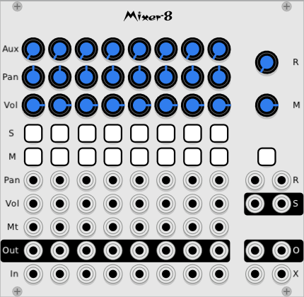

# Mixer-8

8 channel mixer - improved 8-CH Mixer

**Note that we now have the Form expandable mixer. It has more features that Mixer-8, and can be expanded to any number of inputs, both mono and stereo. Details [here](./form.md).**

This module started with a very simple idea. Make a mixer based the popular AS 8-CH Mixer, and fix the problems with it. The problems we saw being the extremely high CPU usage, and the absence of anti-pop on the mutes.

But we got carried away and added channel solo, CV for mutes, and an effect/aux bus. Of course we kept all the features of the original, including the equal power pan law which is one of the best things about it. We also kept all the math of the response to control voltage and knobs.

Even with these new features, however, the CPU usage is still only 10% of the original.

## TL;DR

If you know how to use a mixer, most things should be obvious. Here are the non-obvious things.

The solo buttons normally solo a channel and un-solo the others. But ctrl+solo will let you solo multiple channels.

The sends to the aux bus are post-fader.

The expansion input in the master section is meant for the output of a "slave" mixer.

## Inputs and outputs

**In**: The channel audio inputs.

**Out**: The channel direct outs.

**Mt**: Mute control voltages in. These go through the mute anti-pop filters, so sharp gates may be used without pops.

**Vol**: CV input for volume control.

**Pan**: CV input for pan control.

**X**: Expansion inputs. Typically the output of another mixer is run into the expansion inputs. Signal here is just mixed to the output along with everything else.

**O**: Main stereo outputs.

**S**: Aux bus send. Typically patched to an effect like reverb. This will be a mix of all the channels Aux sends.

**R**: Aux bus return. Typically patched to the output of the effect the send is patched to. Signals here will be attenuated by the "R" knob, and mixed into the master output.

## Controls

**S**: Solo. Will turn off all the other channels and let the soloed channel play on its own. Soloing one channel will un-solo the other channels. When solo is active it overrides mutes, i.e. if you solo a muted channel it will play. Pressing an active solo button will remove the solo.

**M** (in the channel): Mute. Silences the muted channel. Note that the button on the far right is the master mute.

**Aux**: Aux send level. Controls how much of the current channel will be sent to the stereo Aux bux. If the send and return are patched to an echo, for example, Aux will control how much of that channel is send to the echo.

Aux is post-fader, so any channel settings will also affect the Aux send level.

**Pan**: Pans the channel left to right. Uses the AS Mixer's equal power pan law.

**Vol**: Controls the channel's volume. Uses the same tapered response as the AS mixer.

**R**: Sets the level of the aux return as it is mixed into the master out.

**M** (in the master section): Master volume.
