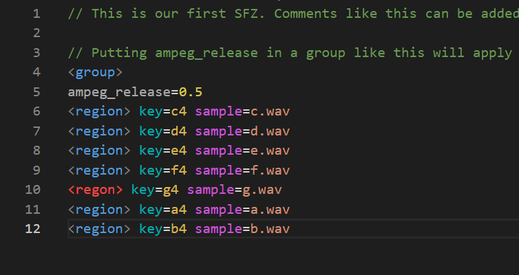

# Make your own SFZ Instruments

It is very easy to make you own SFZ Instruments. All you need is a text editor, and some wav files. You may record your own wave files, or you can download them from somewhere.

Here we will show you some extremely simple examples. To learn more about SFZ, [look here](./sfz-player-about-sfz.md).

As far as text editors, it's possible to use one that is built into your operating system. On Windows Notepad works ok, and on a Mac, TextEdit works ok, as long as you make sure you save as text, and not rtf or some other word processing format.

But - the job is much easier if you use a programmer's text editor. Some common examples are Visual Studio Code, vi, vim, emacs, Sublime, and Atom. If you already have a favorite editor, use it. If you don't, download Visual Studio Code. It's 100% free, and there are plugins for SFZ syntax highlighting that make the job slightly easier.

There are a lot of very good tutorials on the SFZ Format site. They start here: https://sfzformat.com/tutorials/basics.  You will almost certainly want to find more resources if you are making your own SFZ. The good news is that there is plenty of information available.

There are several good video tutorials on making SFZ on YouTube.

## Samples mapped up the keyboard

This is a very simple example, but realistic. Assume you have 7 wave files, and you want trigger each one from a white key starting at middle C. Further, assume that these files are called c.wav, d.wav.... b.wav, and that they are in the same folder as the sfz file you will create.

Because we only want to map each sample to a single key, and because we don't want to transpose, we can use the *key* opcode. So, the first region will look like this:

<region> key=c4 sample=c.wav

That's all you need to do. Save that into a file with the extension *.sfz* and it will play. Now, to make this fully realistic, let's set the ADSR release to something long. This will avoid pops, and let your release match the natural release of the sample. So here it the finished SFZ:

```sfz

// This is our first SFZ. Comments like this can be added anywhere

// Putting ampeg_release in a group like this will apply it to all the following regions.
<group> 
ampeg_release=0.5

<region> key=c4 sample=c.wav
<region> key=d4 sample=d.wav
<region> key=e4 sample=e.wav
<region> key=f4 sample=f.wav
<region> key=g4 sample=g.wav
<region> key=a4 sample=a.wav
<region> key=b4 sample=b.wav
```

This will play a different sample on each white key in the middle octave. Black keys, and keys outside that range will no play anything.

## One sample stretched over an octave

Now let's make an SFZ that stretches one sample from C4 to C5. We will use a.wav again, and assume that it plays an a4 when played without transposition. The following SFZ will let the player transpose the sample to the correct pitches. All you need to do is specify the pitch of the sample when it is not transposed.

```sfz

<region>
ampeg_release=.5
lokey=c4
hikey=c5 
pitch_keycenter=a4
```

## Visual Studio Code

Below is a screen-shot of the sample SFZ from above, as seen in Visual Studio Code. Note that in one place we intentionally misspelled "region", and the plugin can spot this error and highlight in red. The plugin is *vscode-sfz* by Arne Jokela.


