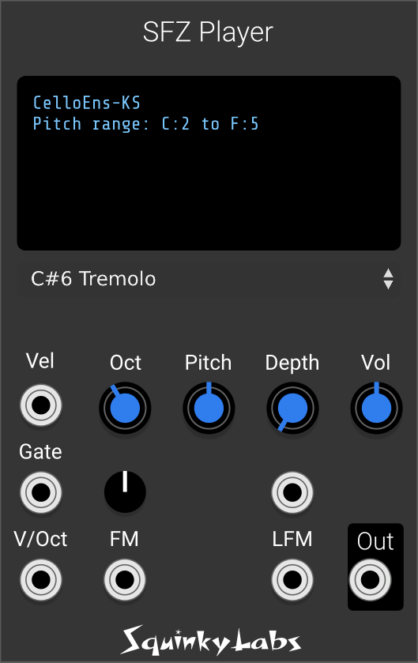

# SFZ Player

## What the player does

It is a VCV module that can load an SFZ instrument and convert CV and Gate into sounds. You can think of is as a sampler like Kontakt (from NI), only more stripped down. And free.

It is fully polyphonic, uses very little CPU, and sounds very good.

In addition to the basic CV and Gate, the player has velocity and pitch modulation inputs. It also has a fairly unique LFM input that lets you do linear, through zero FM using the samples as the carrier.

## What are SFZ instruments

SFZ Instruments, for the uninitiated, are sample libraries. They are usually free or inexpensive. There are many excellent libraries out there to download that have plenty of great sounding pianos, drum kits, orchestral instruments, and on to crazy things.

Because SFZ files are simple text files, and the SFZ format is well documented, it is also easy to make your own SFZ instruments. All you need are some sample files and a text editor.

See the links at the bottom for more information.

## Using the player

You must patch something to the V/Oct input and the Gate input, otherwise you won't get any sound. A typical minimal starting patch would use VCV MIDI-CV, SFZ player and an audio output module. Patch the V/OCT, GATE, and VEL outputs from the MIDI-CV to SFZ Player. Patch the output of SFZ player to the audio output. Select a convenient keyboard from the MIDI-CV module, and set the polyphony to 4 (or whatever you like).

You must also load an SFZ instrument. See the section below on where to get one, if you do not already have any. Bring up the context menu by right clicking on the SFZ Player and select "Load SFZ file". You should see the main display at the top begin to load files. This can be instantaneous to tens of seconds, depending on how large the sample library is. When everything loads correctly the display will show you the name of the SFZ Instrument, and the range of pitches over which it responds.

At this point you would be able to play on the keyboard and have it respond like a typical sampler. If something goes wrong, there will be an error message in the main display.

CV Inputs:

* V/Oct. A polyphonic pitch input that follow the VCV voltage standard of 0V = C4. The polyphony of the V/Oct input will determine the overall polyphony of SFZ Player.
* Gate. A polyphonic gate input that turns the notes on and off. Below 1 V is considered "off" and over 1 V is "on".
* Vel. Polyphonic Velocity input. Unipolar, where 0 V is MIDI velocity zero, and 10V is MIDI Velocity 127. Individual SFZ instruments will use velocity in different ways. A very common one is to use velocity for choosing different samples. Controlling volume is also common.
* FM. An exponential pitch modulation input. May be used for vibrato, pitch bend, or more creative uses. The associated attenuverter will scale the range of this input. Input may be thought of as bipolar, where 0v will be no change, positive voltage will shift pitch up, and negative will shift pitch down.
* LFM. A true "through zero" linear FM. This allows unusual effects where the sample is the "carrier" and the signal on the LFM input is the "modulator". This signal is usually an audio rate signal. It can be considered bipolar, but since (like everyone else) we use phase modulation rather than frequency modulation it doesn't really matter - any DC on the input will not be audible.
* Depth. An optional CV that controls the depth of the LFM. Think of it as an optional VCA on the LFM input. A typical use would be to route in an ADSR to control the amount of FM. This signal is unipolar. 0V is off, and +10 V is fully on. When nothing is plugged in it is as if 10 volts were applied - no change.

Controls:

* Pitch. Tunes SFZ Player over a 2 octave range.
* Octave. Tunes SF Player by octaves over a 10 octave range.
* Vol. Overall master volume control.
* Pitch Trim. An atternuverter that scales the FM input before adding it to the pitch knob.
* Depth. Linear FM modulation depth.

Context menu:

* SFZ Player manual. All of our modules have a direct link to the documentation for the manual.
* Load SFZ file. Opens a file picker dialog to let you select an SFZ.
* Trigger delay controls the 5 sample delay on the gate input. Best to leave it on in most cases

## Where to find SFZ

You will need to download some SFZ instrument to get any sound. There are many out there - here are just a few of them. The following are popular and work well with SFZ player. All are free.

**Virtual Playing Orchestra**: http://virtualplaying.com/virtual-playing-orchestra/
The standard "go-to" collection of orchestral instruments.

**Versilian Studios**: https://vis.versilstudios.com/index.html
Many free SFZ and many reasonably prices ones. They have two must have collections:

* VCSL: a collection of all kinds of sampled instruments.
* VSCO-2: a collection of mostly orchestral instruments.

The **K18 upright piano** is very popular. It's also not huge:  http://rudifiasco.altervista.org/

The **Ivy Piano** is very high quality. Due to the large size, download it usually via torrent or small donation: https://www.ivyaudio.com/Piano-in-162

The **Salamander drum** kit is also a popular instrument. https://archive.org/details/SalamanderDrumkit.

Just using the free instruments listed above will give you a lot of useful and good sounding instruments. But there are an enormous number of them out there if you are willing to do a little web searching.

With just one orchestral collection you will have huge number of sampled instruments.

## Plays a subset of SFZ

The SFZ specification is huge, and really designed for implementing a super high end sampled instrument. For a variety of reasons, this player does not implement the full SFZ specification, but only a subset of it.

The result for the user is that any given SFZ instrument may play perfectly, poorly or not at all. So, it’s going to be a matter of trial and error. Often the instrument will play just fine. Sometimes not. Unless you are in incurable tinkerer, there isn’t much you can do if an instrument doesn’t play correctly in our player. Time to move on and try an alternative.

## RAM usage

Like most VCV samplers, this module loads all of the sample data into RAM. Becuase SFZ player does not use "disk streaming" it always works, and there are no fiddly settings for disk cache size.

But it is not uncommon for an SFZ file to have a gigabyte or more of sample data. When we load up the sample data, we convert it to mono, and convert it to 32-bit floating point format. Since many SFZ use 24 bit data and are stereo, this means that the amount or memory used is roughly in the ballpark of the total size of all the samples. So, use your operating system to find out how big all that data is. If you try to load a patch whose data is larger than the total amount or RAM in your computer, something bad will happen. VCV might become very slow and laggy, and audio might drop out. It may even make VCV unresponsive. If that happens, force quit.

On the other hand, computers today tend to have 16 or even 32 GB of RAM. Which leaves quite a lot for loading large sample banks.

## Links

[More information about SFZ files](./sfz-player-about-sfz.md)

[How does it work](./sfz-player-how-does-it-work.md)

More on obtaining good SFZ files [here](./sfz-player-obtain-instruments.md)

More about SFZ compatibility, and what opcode are implemented, [here](./sfz-player-compatibility.md)

[How to make your own SFZ files](./sfz-player-make.md)

