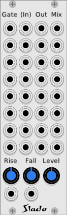

# Slade

Octal lag / slew / vca

This module has 8 independent lag generators, and 8 VCAs. It may be used to smooth out gate signals so that they don't cause pops, or it may be used as a VCA to gate an audio signal with a simple envelope generator.

Each of the eight independent stage can be thought of as:

* A simple anti-pop filter to smooth out a control voltage.
* An Attack-Release envelope generator, optionally driving a VCA.

In addition, any subset of the stages may be summed together to make a mix of the stages above them.

Each of the 8 channels is independent, although they all share common rise and fall settings.

To use a channel as a lag unit, patch the CV to be lagged into the gate input (first column). A lagged version will be available at the output (third column). Leave the (audio) input un-patched.

To use a channel as a VCA/AR, patch a 0..10 v CV into the gate input (first column). Patch the audio to be gated into the audio input (second column). The output will have the audio input multiplied by the output of the lag generator, which in this case should be thought of as an AR (attack/release) envelope generator.

The gate inputs and mix outputs are "normalled", so that they do not always need to be patched to do something sensible.

The mixed outputs are configured such that any patch cord put into the mix output of a channel will receive a mix of that channel's output, and the outputs of any channels above it that do not have patched mix outputs.

For example, a patch-cord inserted into the mixed output of channel 2 will have a mix of channel 1 and 2. Then a patch-cord inserted into mixed output 6 will have a mix of channels 3, 4, 5, and 6.

The normalling of the gate inputs is easier to understand. If a gate input is not patched, that channel will use the same gate as the channel above.

A simple example: if an LFO is patched into the top (first) gate input, it will gate all 8 channels.
