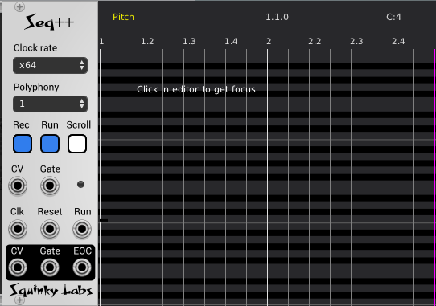

# Seq++ Polyphonic piano-roll sequencer

New features:

* 1.0.8: Functions as a remote editor for 4X4.
* 1.0.7: Clipboard interchange with other Sequencers, single command clock hookup.
* 1.0.6: Xforms for creative edits like chop notes, make triads, and transpose within scale.
* 1.0.5: Step record from MIDI keyboard, MIDI file load/save, and user definable keyboard mapping.

## Table of contents

[Major features](#Major-Features)\
[About this Sequencer](#About-this-Sequencer)\
[FAQ](./sq-faq.md)\
[Grids](#Grids)\
[Editing](#Editing)\
[Xforms](#Xforms)\
[Settings](#Settings)\
[Adjusting length of sequence](#Adjusting-length-of-sequence)\
[Auditioning notes](#Auditioning-notes)\
[Looping and editing while playing](#Looping-and-editing-while-playing)\
[Keyboard and focus](#Keyboard-and-focus)\
[Panel](#Panel)\
[Clocking and playback](#Clocking-and-playback)\
[MIDI file I/O](#Midi-file-io) \
[Step recording](#Step-recording) \
[User Keyboard Mapping](./sq-kbd.md) \
[Keyboard reference](#Keyboard-reference)\
[Mouse reference](#Mouse-reference)

## Major features

Polyphonic sequence of unlimited length.
Graphic “piano roll” note editor. Undo and redo of every change.
Notes may be entered and edited with the mouse, PC keyboard, or MIDI keyboard.
Notes may be edited while the Sequencer is playing.
Easy to enter and play back “conventional” music.

## About this Sequencer

This sequencer is a hybrid of a modern DAW's MIDI editor, and the MS-DOS sequencer "Sequencer Plus Gold" originally released in 1984. Sequencer Plus was the first popular sequencer to feature a "piano roll" note editor.

So, while Seq++ is much like a typical DAW's MIDI edit screen, it is not exactly like those. You may enter notes with a mouse, as you would expect, but there is also an extensive keyboard interface. Because of this hybrid identity, there are two cursors: the mouse cursor and the blinking keyboard cursor.

The note editor is heavily focused around the keyboard interface, which allows the user to "type in" music very quickly. More conventional note-entry is available with the mouse.

There are some concessions to the current world - it has unlimited undo/redo, and clipboard support.

## Editing

Editing consists mainly of inserting, deleting, and changing notes. If you use Seq++, you will spend most of your time editing. So it will be a big help to know all the different features that make this fast and easy.

Most editing can be done with the mouse or with the keyboard. Many operations can be done much faster with the keyboard, so it can be very rewarding to learn the keyboard commands. There are not that many of them, but unlike the mouse operations they are very difficult to guess; you need to read the manual.

The settings menu can have important effects on many of the editing commands, so be sure to become familiar with the settings.

### General Information

It’s very easy to forget that Seq++ has features you would expect in DAW software, but wouldn’t expect in a VCV module. Always remember that Seq++ is fully integrated with the undo/redo system in VCV, so any change in note data can be easily undone.

Similarly, it is easy to forget that Seq++ has a clipboard, so it is super easy to move data around, and you may even copy from one instance on Seq++ and paste into a different instance.

Another feature that is easy to forget about is multiple selection. Selected notes show in yellow, and it is easy to select several notes, and they will all display in yellow. Once several notes are selected any edit operation will change all of the selected notes.

One unusual and sometimes awkward feature is that there are two cursors. There is of course the normal mouse cursor that is always available in your operating system. There is also a blinking *edit cursor*, much like an old DOS computer. Often they are in the same location, but often they aren’t. Usually the blinking cursor is controlled by the keyboard, and the mouse cursor is controlled by the mouse. The differences will become apparent with use.

### Editing with the mouse

Using the mouse to edit and move notes is somewhat intuitive, and will be quite familiar if you have used a MIDI editor or DAW. But, as with anything, different DAWs make different choices for common action, so ours may be very familiar, or not.

The basics:

* Double clicking in empty space will insert a note, the length of one grid unit.
* Double clicking on a note will delete it.
* Dragging the first third of a note, or group of notes, will move the start time.
* Dragging the middle third will drag up and down in pitch.
* Dragging the last third will shorten or lengthen the duration(s). 

Some things to keep in mind:

* The snap to grid option will quantize the cursor position, and notes whose start times are dragged.
* The snap durations to grid option will quantize the duration when durations are dragged.
* Durations may not be shorted smaller than a grid unit.

It might appear that you are stuck with a two bar sequence that cannot be lengthened, but this is far from true. Pressing the end key, or holding down the right cursor, will move to later bars. If you go to bar 4, for example, and insert a note, the sequence will be automatically lengthened to accommodate it. And there are both keyboard and mouse commands to move the end point to the cursor. But for now at least,it is difficult to scroll to these later bars without using the keyboard.

### Editing with the PC keyboard

There are a bunch of options for moving around in pitch and time, in units of quarter notes, grid units, bars, sixty fourth notes, semitones, octaves. Move to next note or previous note.

There are also lots of options for inserting notes. Insert half note, quarter note, eighth note, sixteenth note, grid unit. Automatically advance the cursor after inserting a note / or not.

There are lots of options for shifting, stretching and transposing one or more notes by any of those units.

Check out the [reference on keyboard commands](#Keyboard-reference)\ for more on that.

### The two context menus

There are two different context menus, and each has different things. One comes up when you right-click on the grey panel. The other one comes up when you right click on the note grid. We call the one available from the panel the **panel context menu**, and the one available from the note grid the **editor context menu**.

The **panel context menu** is mostly the standard VCV Rack context menu. Seq++ adds:

* A link to the manual
* The "hookup clock" command
* Enable remote editing (for use with 4X4)
* Load MIDI file
* Save MIDI file

The **editor context menu** contains:

* Grid settings sub-menu
* Snap to grid on/off
* Snap duration to grid
* Audition on/off
* Articulation sub-menu
* Loop subrange on/off
* Insert note command
* Set end point (where the sequence ends)
* Finally, all the various xforms (transforms)

### Simple examples

(1) Turn Audition on in the context menu. Click on a note to select it. Press Tab and ctrl-Tab to select next and previous note. Hold down the shift key and press tab a few times to select a sequence of notes. The press the cursor up key seven time to transpose the notes up a fifth.

(2) Select a note on the grid by clicking on it with the mouse. Hold down shift and click on a few more notes to expand the selection to multiple notes. Click and hold in the middle of one of the selected notes, and drag up and down to transpose all the selected notes.

These two simple examples show that most things can be done entirely from the keyboard, or entirely with the mouse.

(3) Make a few bars of music. Then use ctrl-a to select all the notes, and ctrl-c to copy them all to the clipboard. Go to a second instance of Seq++ with no music in it. Put the cursor to the start of the first bar and press ctrl-p to paste the music into the new sequence. While the notes are all still selected, press ‘s’ to set the keyboard for editing start time, then press + a few times and see the notes become delayed in time. Press ‘p’ to set pitch editing, and press + a few times to transpose the music by a few semi-tones. Now you have the original music on one sequencer, and a delayed, transposed copy in another.

(4) To insert a measure of eighth notes, it’s sometimes easier to insert them all first, then edit the pitch. Assuming you song is in A minor, put the cursor at the beginning of an empty bar, on A. Press the e key eight times to fill the bar with eighth notes on the A pitch. Then use the home key to move back to the start of the measure, and type the p key to set the editor for pitch editing. You can use the tab to get to the next note. As you land on each note, shift the pitch to the desired pitch by pressing + to shift up by a semitone, or - to shift down. So to shift up to the minor third (C) press + three time. To shift down to the minor seventh (G) press - twice.

(5) Make a bar full of sixteenth notes, by pressing the x key sixteen times. Then pick some notes to remove, by holding down the ctrl key and clicking on the notes you want to get rid of. Then press backspace to remove them. Instant rhythm.

(6) Here’s an easy way to enter a chord sequence - in this case DMaj to EMin. Put the cursor on the pitch “D” that is empty. Press shift-Q to insert a quarter note at D. The shift key will keep the cursor from advancing. Now press the up cursor four times to get to F#, and insert this pitch again with shift-Q. While still holding down the shift, cursor up 3 more semitones to A. Now release the shift key and press q again. You will have a DMaj chord of quarter notes, and the cursor will have advanced to the next quarter note. Next, select the chord you just inserted by holding down the shift key and clicking on the top and bottom note. Use ctrl-c to copy the chord to the clipboard. Move cursor to a blank region and press ctrl-v to paste a copy of your DMaj chord to a new beat. Now put the editor in pitch edit mode with the p key, and use the tab key to select each of the notes in the copy of the chord you pasted. As you select the notes, use the + key to transpose them up. Transpose the D up 2 to E, transpose the F# up on to G, and transpose the A by two to B.

## Xforms

The Xforms (short for transforms) are a collection of  "destructive edit operations". They all operate over the selected notes, often transforming a note at one pitch to another pitch.

They all work more or less the same way:

1. Select some notes as you normally would in the note grid.
2. Pick one of the xforms from the context menu.
3. A dialog will come up with settings for that xform. Set them as you like.
4. If you press OK, the xform will by applied to the notes you have selected.

Many of the xforms require you to select a scale. The scale is stored in the patch, so once you set it for your patch it should be remembered and you shouldn’t have to re-enter it every time.

Complete details on each xform are in a separate document: [xforms](./xforms.md)

We wrote a post with lot of illustrations about XForms on the VCV community site: [here](https://community.vcvrack.com/t/somes-uses-for-the-xform-feature-in-seq).

## Grids

The context menu available by right-clicking in the note grid contains several options for the timing grid. 

The grid has two major effects: (1) grid lines are drawn in between the measure lines to help visually align timing; and (2) many edit operations are affected by the grid setting, in conjunction with the snap to grid option.

When snap to grid is enabled, [almost] all cursor positioning is quantized to the nearest grid line.

Note that as the grid units get smaller, not all grid lines will be drawn. For example, at the moment only every other grid line is drawn if the grid is set to sixteenth notes. This is because the screen would get too cluttered it all the lines were drawn.

Snap duration to grid will ensure that dragging note durations with the mouse will snap the durations. But it will not affect the durations of notes inserted with the keyboard commands (like h, q, and e), since these are already fixed by  the articulation setting. It only affects dragging with the mouse.

## Settings

Right-clicking in the note area will bring up the **editor menu**. This menu consists of settings (like grid size), as well as some commands, like insert/delete note and xforms. All of the settings are at the top, and the commands follow after a blank space.

Settings:

* **Grid settings** lets you choose the timing units of the edit grid.
* **Snap to grid**: When enabled, the edit cursor is usually snapped to the grid, ensuring that notes will be inserted on the grid unless special effort is employed.
* **Snap duration to grid**: When enabled, dragging note lengths with the mouse will drag onto the nearest grid line.
* **Audition**. When a note is selected, and the sequencer is not running, the note will be played thought channel 1 so that you can hear what you are editing. Audition is on by default, but may be turned off in the settings menu.
* **Articulation**. Determines the duration when a note is in inserted. With 100% articulation, a quarter note would take up the entire duration of a quarter note.

Note that all of the settings are saved with your patch.

Commands:

* **Insert/Delete** note. This menu item changes depending on what is under the cursor. If nothing is there, it will insert a note. If a note is there, it will delete it. (note that double click does that same thing).
* **Set end point**. Will set the end/loop point of the sequencer to the grid line nearest the cursor.
* **xform: Transpose**. Brings up a popup with many transpose options.
* **xform: Invert**. Brings up a popup with many melodic inversion options.
* **xform: Reverse pith**. Like a retrograde. Reverses the order of all the pitches.
* **xform: Chop note**. Easy way to create arpeggios and polyrhythms.
* **xofrm: Quantize pitch**. Forces pitches to be in a particular scale, like a quantizer module.
* **xform: Make triads**. Makes a variety of chords from a single note.

(see section above for more on these powerful transforms)

## Adjusting length of sequence

Seq++ always plays your sequence in a loop, and the looping comes back around when the “play head” hits the end of the sequence. 

The sequence end is indicated by a vertical purple line in the note grid.

Sequence end point is initialized to the end of the second bar, and can be moved in several ways:

* The ‘e’ key will set the end point to the nearest grid point to the edit cursor.
* Any edit operation can extend the sequence length to include the results of the edit. So if you drag a note to an area past the end, the end will be extended.
* The *set end point* command in the setting menu will do that, too.

For example, if the sequence end is at the end of the second bar, and you move the edit cursor up into bar 10 and insert a note, the edit point will be moved to after the note you just inserted. Similarly, changing the start time or duration of a group of notes may extend the sequence length.

## Auditioning notes

By default, every time you select a new note (with cursor or keyboard), it plays on the first output channel. This lets you hear the notes as you are editing. If you don’t like this, it may be turned off in the context menu.

Holding down the tab key while auditioning will let you quickly hear all the notes in your sequence, one at a time.

## Looping and editing while playing

The looping feature lets you play a range of bars, which can be quite useful when you are editing notes and don’t want to play from the start every time. Looping is toggled on and off with the l key. The loop range is always the range shown in the note editor (the two bar range on the screen).

Looping may be turned on and off while Seq++ is running, and of course you may edit the notes as the sequencer plays. You may also move the loop points in time by moving the edit cursor. Moving by whole bars with the home and end keys is probably the most useful.

It is almost impossible to edit while playing if the playback scrolling is turned on. When scrolling the sequencer will move the edit cursor all the time, making it very difficult for you to edit.

While Seq++ is playing you can turn loop on and off, freely move the time range, and use all the edit commands. It will not glitch or get out of sync. Switching looping off can be jarring, however, as the play point will immediately go to where it would have been if you never looped - often far past the current loop range.

## Keyboard and focus

Throughout this manual, we refer the the "control key" (ctrl). On the Macintosh, however, we substitute the command key for these functions, as is customary on that platform.

Keys will repeat if you hold them down.

As mentioned before, the UI is heavily keyboard driven. The module will only respond to the keyboard if the mouse cursor is over the note editor, in which case it will grab the focus as you type. Once the module has focus it keeps it until you click outside. Normally this means that the mouse can move anywhere outside the module, but the keyboard will still control Seq++.

But there are some keys that VCV Rack itself tries very hard to steal from Seq++, like the cursor keys and the backspace key. For these keys, the mouse must stay over the piano roll for Seq++ to get those keys. 

That is why for all these keys there are substitute keys that also work, and do not have to fight with VCV for control of the keyboard. Both 4 keys will cursor to the left, and both 6 keys will cursor to the right.

If you find it annoying to have VCV try to steal important keys from you, like cursor movement keys, there are several workarounds:

* There are alternate key to move the cursor, like 4,5,6,2 on the numeric keypad. These are less intuitive, but VCV won't steal them.
* You can assign whatever keys you like to any function using the [User Keyboard Mapping](./sq-kbd.md) feature.

Many key commands take input from the grid size set from the settings menu. For example, the Ins key will insert a note whose value is the current grid unit.

Commands that are mapped to letter keys will usually work with either lower or upper case. In some selection operations, however, the shift key is used to extend a selection. And when inserting notes the shift key will suppress the cursor advance.

## Panel

On the left are a few inputs, outputs, and controls.

**Clock Rate** dropdown determines the clocking. These settings tell the sequencer how to interpret the external clock input.

**Polyphony** dropdown selects how many voices will be played back.

**Run/Stop** button that changes color to  indicate when it's running. The run state is controlled from this button, as well as the external run input. Either of them can start and stop the sequencer. This button is modeled on the run button in "Clocked", from Impromptu Modular.

**Scroll mode** button enabled scrolling while running.

**CV** is the [polyphonic] pitch CV output. It will be polyphonic if Seq++ is set for more than one voice.

**G** is the gate output. It will be polyphonic if Seq++ is set for more than one voice.

**CV in and Gate in** are the keyboard inputs for step recording.

**Clk** is the eternal clock input.

**Rst** is the reset CV. It is compatible with the reset out of "Clocked".

**Run** is a CV input. Meant to be hooked up to the Run output of Clocked, or similar master clock.

## Clocking and playback

New in version 1.0.7: Use the "Hookup Clock" command to do all the steps below.

Always keep the following in mind:

* The Clock Rate control only affects playback.
* The "grid" is merely a graphic overlay drawn on top of the edit window. It has no effect on playback. Ever.
* If "snap to grid" is enabled, some note editing operations will quantize to the grid, but it will still have no effect at all at playback time.
* You can avoid confusion by using the finest clock rate, X64. Then use other clock rates for special purposes when the resulting quantization is something you want / expect, of when you have learned more about clocking in Seq++

You will need to patch a clock source to Seq++. Almost anything will do - even an LFO. *Clocked* from Impromptu Modular is an excellent choice, so we will describe how to get the best results using Clocked. But many other clock generators will work.

Connect the clock, run and reset outputs of Clocked to the corresponding inputs of Seq++.

Set Seq++'s clock rate to match the *Ratio* in clocked. So if Clocked is set for X64, set Seq++ to *X64*.

For DAW workflows, or other times when you want fine timing, use as fine a clock resolution as possible (Clocked X64). To intentionally coarsely-quantize Seq++, use a less fine clock.

If you are using Clocked, or its smaller sibling CLKD, the "Hookup Clock" command found in the main context menu will do all the patching for you. Just insert a supported clock module, set up the Seq++ clock divider to what you want, then select Hookup Clock. Seq++ will automatically find a clock, patch it in, and configure it.

When Seq++ quantizes during playback, it should quantize "correctly" - i.e., it should quantize to the **nearest** clock. Both the start time and duration will be quantized.

If two notes of the same pitch "touch" each other, such that the end of one note is at the same time as the start of the next, Seq++ will re-trigger the note by bringing the gate low for a millisecond. Note that with quantization it is very common for two notes to touch this way.

If the sequence is set for monophonic, then it should play a proper legato if the notes fully overlap (the second one starts after the first one ends). But remember that quantization may erase this overlap, causing the re-trigger to kick in.

If there are more simultaneous notes being played than may be accommodated by the polyphony setting, then voices will get "stolen" and re-assigned to play the new notes. At the moment Seq++ uses a variation on "last note" assignment. If there is already an idle voice that was playing the new pitch, that voice will be selected. Then the next idle voice (in rotation) will be used, then the first voice will be used.

## MIDI file I/O

Seq++ will import and export standard MIDI file. This is an easy way to get track from another piece of software into VCV.

The MIDI file features are on the main context menu - the one you get when you right click on the panel (not the note-grid).

The import is very simple. It looks for the first track in the file that has notes on it, and imports the entirety of that track. It only imports notes, and ignores other MIDI data.

Export saves the entire (single) track in a type-0 MIDI file.

## Step recording

Step recording is an ancient sequencer feature that lets you quickly enter music from a musical keyboard without having to worry about playing accurately.

To use step recording in Seq++, patch a CV and Gate to the corresponding inputs of Seq++. The VCV Core module "MIDI-CV" is a good source. Set the source to the degree of polyphony you want - just cranking it to 16 is fine.

Once hooked up, playing a note on the keyboard will insert a note in Seq++ and move the cursor forward. The magic is all in how step recording decides what attributes to use for new notes. In many ways, step recording is very similar to entering notes from the computer keyboard.

Here are the rules:

* The pitch of the note will be the pitch of the note on the music keyboard.
* The start time of the note will be wherever the edit cursor in in Seq++.
* The duration of the note will be the same as if you inserted from the keyboard - typically the grid time unit modified by the articulation setting. Well, see below for more on this!
* When the note is released on the MIDI keyboard, Seq++ will advance the cursor by a grid unit.

Of course you can do this with chords. As you press down more notes the notes in Seq++ will stack up, making a chord. The cursor is not advanced until all the notes in the chord are done.

But you can override the duration without changing the grid! Use any of the keys that normally insert a preset note duration, like w,h,q,e,x. This will change the duration of any notes that are still being held down. This feature makes it much easier to enter a series of notes with different metric values.

btw - if you are using step record, but don't know all about editing from the mouse or computer keyboard, you might want to read about those topics. As we said, step recording is very similar to entering music from the computer keyboard.

## Keyboard reference

### Misc commands

**n**: Sets the end point of the sequence to the current cursor time. Time is always quantized to the grid, even if snap to grid is off.

**l**: Loops a range of bars from the track. Loop range is the bars that are on screen. May be turned on and off while playing. Moving the "viewport" to a different range of bars will change the loop range, even if you are playing when you do it.

### Moving around

The normal cursor keys can be used to move the edit cursor, but this can be inconvenient, as VCV will fight with you for these keys. If the mouse cursor isn't over the note grid, then Seq++ can not get those keys.

For that reason, the numeric keypad (2,4,8,6) can also be used to move the cursor, as can 4,5,6,r.

**cursor keypad, 456r, and keypad 2,4,6,8**: Moves cursor in two dimensions. Up and down by semitone, left and right by one grid unit.

**ctrl-cursor, ctrl-4,6, and ctrl-4,6 on keypad**: Moves left and right by a quarter note.

**home, end**: Moves one bar earlier or later.

**ctrl-home, end**: Moves to first bar or last bar in the sequence.

**PgUp, PgDn**: Moves up or down by an octave.

### Selecting notes

**ctrl-a**: Selects all the events in the track.

**tab**: Select next note.

**ctrl-tab**: Select previous note.

**shift-tab**: Extends selection to include the next note.

**ctrl-shift-tab**: Extends selection to the previous note.

Moving the cursor onto a note will select it.

### Inserting and deleting notes

When a note is inserted, its start time and duration will not be quantized, no matter the snap to gird settings. But since most cursor movement **will** qunatize the cursor time when snap to grid is on, notes will naturally tend to be inserted on the grid. But it is possible to move off the grid and then use any of the insert commands.

After a note is inserted the cursor will be advanced past the note just inserted, unless the shift key is held down.

**Ins** or **Enter** Inserts a note at the current cursor. Duration will be one grid unit by default, but may be set to whatever you want with the asterisk key.

**Del** Deletes the currently selected notes.

**Insert preset note durations**. These shortcuts insert a note of a specific duration:

* **w**: Whole note.
* **h**: Half note.
* **q**: Quarter note.
* **e**: Eighth note.
* **x**: Sixteenth note. Note that 's' key is already used for Start time, so 'x' is used for sixteenth note. Ctrl-s will also work.

**Asterisk** (*): Will take the duration of the note under the cursor and use that as the duration for all subsequent notes inserted without explicit duration (i.e. from the Ins and Enter keys, and from double-clicking the mouse).

**Very Important**: By default the cursor will advance after inserting a note, making it easier to insert a stream on notes in succession. But if you hold down the shift key the cursor will not move ahead, making it easy to insert chords.

### Changing notes

**s, p, d**: Set note attribute to be edited (Start time, Pitch, and Duration). The current mode is always displayed in the status area above the note grid.

When notes are selected and StartTime or Duration is current edit attribute:

* **plus** and **minus**: Change by one grid unit.

* **], [**: Change by a quarter note regardless of grid setting.

* **<, >**: Change by a sixty-fourth note.

When note is selected and Pitch is current edit attribute:

* plus/minus changes by one semitone.
* ], [ changes by an octave.

### Cut/Copy/Paste

**ctrl-x**: Cut. Removes all the selected notes and puts them on the clipboard. (doesn't work yet).

**ctrl-c**: Copy. Puts a copy of all the selected notes on the clipboard.

**ctrl-v**: Paste. Pastes the contents of the clipboard at the current edit cursor.

Note that you may paste into a different instance of the sequencer than you copied from, as you would expect.

### Undo/Redo

Seq++ uses VCV's undo system, which is available from a mouse menu and from keyboard shortcuts.

**ctrl-z**: Undo.

**ctrl-y, shift-ctrl-z**: Redo.

When Seq++ performs an undoable edit operation, you will see it in VCV's undo menu. It will look something like **Seq++: delete note**, so you will know what you are undoing, and that is was Seq++ that it will be applied to.

### Help

**F1 key**, when note editor has focus.

## Mouse reference

Clicking on the note grid will move the blinking edit cursor to the click location. If snap to grid is on, the edit cursor location will snap to the grid.

### Selecting notes with the mouse

**Click** on a note will select it, and deselect all others.

**Ctrl-click**: on a note will toggle its selection state, while leaving any other selected notes selected.

**Shift-click** will extend the selection up to the cursor. This means all previously selected notes will stay selected, and all notes between the cursor and the selection will get selected, too.

### Inserting and deleting notes

Double clicking on a note will delete it.

Double clicking on an empty location will inserts a note:

* By default the duration will be one grid unit.
* You may override the default duration using the asterisk key.

### Changing notes

**Transpose**: If you click and hold in the middle of a selected note, you can drag all the selected notes up and down in pitch.

**Shift**: If you click and hold at the start of a selected note, you can drag all the selected notes left and right in time.

**Stretch**: if you click and hold at the end of a selected note, you can drag all the selected notes left and right in duration.

### Help

Help in all Squinky Labs modules can be accessed from the context menu that appears when you right-click on the panel. This will be the Seq++ help, not the full instruction manual.
