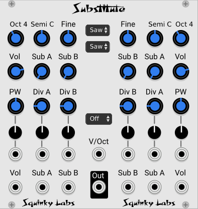

# Substitute

Substitute is inspired by the VCOs from the Moog Subharmonicon. It’s adapted from the Fundamental VCO-1, which has been heavily modified to generate the subs. This VCO has very low aliasing. So, unlike the divisions you would get with a typical divider, there is almost no aliasing in these subs.

Like the Moog unit each "voice" has two fundamentals, and each fundamental has two subharmonics.

There is a waveform control that’s the same as the Moog Square, saw, and a mixture.

By their nature, the subharmonics will often be somewhat out of tune with an equal tempered scale. We attempt to explain this in the section below about harmony. Other information can be found in the Moog manual or by watching a demo to learn more about this, and why you might want to use a just intonation quantizer.

The built in quantizer will quantize what comes in the V/Oct input. Like the Moog, the scale of the quantizer is always based on "C". If you want to get other keys you need to offset the CV, then re-tune it with the pitch  controls.

## The basic architecture

One of the unusual things about this VCO is that each "voice" always has a pair of VCOs which we call 1 and 2. There is a full set of control and CV for each VCO in the Pair. They are completely independent except for two crucial things.

There is only V/Oct per voice. So the 1 and 2 VCOs see the same V/Oct input, if the input is monophonic it will drive both VCO 1 and 2.

Also, there is a single output that 1 and 2 are mixed into. So the output is a six input mixer that mixes all size of the VCOs and subs in the pair.

The main (fundamental) VCO has a choice of waveform: Saw or Sq for Sawtooth and Square. Note that Sq is not limited to a square - the PW control and PWM input let you change the pulse width.

Each VCO in the pair also has two subhamonics available. The subharmonics are derived directly from the main VCO - they will always be an exact integer division of the main VCO output.

## A bit about the harmony

First, a little review. There are many tuning systems in the world, and many used thought history. These days the 12 tone equal tempered tuning is the standard tuning in western music. Most common instruments approximate this tuning. This is a compromise tuning system where most of the intervals are slightly out of tune, with the advantage that an equal tempered music instrument can play in any key without re-tuning.

Long before equal tempered tuning, "Just Intonation" was often used. In just intonation the intervals are exactly in tune. The down side is that instruments need to be tuned to a given key, like C or F. Even switching keys in mid-composition will compromise tuning.

So, for the last several hundred years equal tempered tuning has been by far the most common in the west.

Now - on to VCO's with subhamonics!

While it's fine to just use this gizmo to get giant bass sounds with lots of sub-octaves, there is also a world of crazy music outside of those obvious uses. But using many of these subharmonics can be challenging.

We are used to normal harmonics that occur at even multiples of the fundamental, 2X is an octave up, 3X is an octave and a perfect fifth, 5X is two octaves and a perfect major third, etc... Of course in the 12 tone equal tempered tuning system the actual frequencies of fifths and thirds isn't the same as the "perfect" intervals, but they are "close enough for classical".

The subharmonics, however, are a different story. They do not occur much in nature. Some of them are at even octaves below the fundamental, but the rest of them are at pitches that can be quite far from any interval in the 12 tone equal tempered scale. The result is that if you tune the VCOs up to a high enough pitch, and set the subs to 1/5 or anything other than even octaves, the subharmonic will be out of tune. In general the farther you go down into the subs, the more out of tune they are. Often quite out of tune!

But - these out of tune subharmonics are in many cases "in tune" in a Just Intoned scale! That's why there is a just intoned quantizer included.

So it you use the quantizer set to just intonation (7 or 12 tones), all those "out of tune" subharmonics aren't out of tune any more. But they will be out of tune with other instruments or patches that are in equal tempered tuning.

That gives some obvious choices when using Substitute:

* Only use the subs on even octaves, and don't worry about tuning.
* Use the "out of tune" subs quantized to equal tempered scale, and find creative ways to use this strange tuning, perhaps to contrast with other sections that are "in tune".
* Use just intonation, and develop your whole patch around this tuning.

There are many others - that's just a taste.

## A note on volume

With six VCOs feeding a mixer there can be a great variation in volume if you aren't careful. You may find as you bring in subs and such the volume can creep up and up. That's fine, but there is an option to control this automatically: the AGC option in the context menu.

The AGC acts like a very aggressive peak limiter. Once you turn up some of the volumes you will hit a max, and it won't go over that.

On the other hand, if you are setting up elaborate modulations of the mixer inputs, you many not want the heavy hand of the AGC, so feel free to use it or not as you see fit.

## Reference - the notes of the just intoned scales we used

For the seven note scale we used:

* Root pitch ratio 1.
* second: 9/8.
* third: 5/4.
* fourth: 4/3.
* fifth: 3/2.
* sixth: 5/3.
* seventh: 15/8

For the 12 note scale we used:

* Root pitch ratio 1.
* minor second: 16/15.
* second: 9/8.
* minor third: 6/5.
* third: 5/4.
* fourth: 4/3.
* flatted fifth: 45/32.
* fifth: 3/2.
* minor sixth: 8/5.
* sixth: 5/3.
* minor seventh: 9/5.
* seventh: 15/8.

## The controls

**Oct, Semi, and Fine** combine to set the initial pitch of the VCO and the subharmonics derived from that VCO.

**Waveform** is independent per side, so there is one selector per side. When set to saw

**Vol** the volume of the fundamental waveform. Mix is square for the fundamental and sawtooth for the subs.

**Sub A and B** the volume for the two subharmonics.

**PW** sets the pulse with for any VCOs on that side that are set to square.

**Div A and B** the frequency ratio between the sub and the fundamental. For example, "3" means that the frequency of the sub is one third of the fundamental.

**The row of small knobs** are attenuverters that scale and invert the CV inputs below them.

## The jacks

The lower row of jack have six CV input to control the mixing of the 6 VCO source, and the audio output.

The upper row of jacks feed attenuverters and the get added to the knobs above that. The vertical lines show which jack is associated with which knob and attenuverter.
